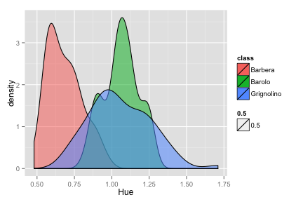

1. Introduction
===============
With the Wine dataset we will be applying a supervised learning to predict the class of the unknown wine. In this initial project we will perform an EDA on the dataset to understand the distributions of the variables with the context of classification in mind.

2. Procedure & Analysis
=======================
2.1 Data import
---------------
First we begin by loading the data. 

```r
library(MMST)
data(wine)
```


2.2 Summary EDA
---------------
Let's begin the EDA process by performing a quick viewing and summary reports on the entire dataset.

```r
head(wine)
```

```
##   Alcohol MalicAcid  Ash AlcAsh  Mg Phenols Flav NonFlavPhenols Proa Color
## 1   14.23      1.71 2.43   15.6 127    2.80 3.06           0.28 2.29  5.64
## 2   13.16      2.36 2.67   18.6 101    2.80 3.24           0.30 2.81  5.68
## 3   13.86      1.35 2.27   16.0  98    2.98 3.15           0.22 1.85  7.22
## 4   14.10      2.16 2.30   18.0 105    2.95 3.32           0.22 2.38  5.75
## 5   14.12      1.48 2.32   16.8  95    2.20 2.43           0.26 1.57  5.00
## 6   13.75      1.73 2.41   16.0  89    2.60 2.76           0.29 1.81  5.60
##    Hue   OD Proline classdigit  class
## 1 1.04 3.92    1065          1 Barolo
## 2 1.03 3.17    1185          1 Barolo
## 3 1.01 3.55    1045          1 Barolo
## 4 1.25 3.17    1510          1 Barolo
## 5 1.17 2.82    1280          1 Barolo
## 6 1.15 2.90    1320          1 Barolo
```

```r
str(wine)
```

```
## 'data.frame':	178 obs. of  15 variables:
##  $ Alcohol       : num  14.2 13.2 13.9 14.1 14.1 ...
##  $ MalicAcid     : num  1.71 2.36 1.35 2.16 1.48 1.73 1.87 1.6 1.77 1.5 ...
##  $ Ash           : num  2.43 2.67 2.27 2.3 2.32 2.41 2.38 2.52 2.62 2.7 ...
##  $ AlcAsh        : num  15.6 18.6 16 18 16.8 16 12 17.8 16.1 22.5 ...
##  $ Mg            : int  127 101 98 105 95 89 102 95 93 101 ...
##  $ Phenols       : num  2.8 2.8 2.98 2.95 2.2 2.6 3.3 2.48 2.85 3 ...
##  $ Flav          : num  3.06 3.24 3.15 3.32 2.43 2.76 3.64 2.37 2.94 3.25 ...
##  $ NonFlavPhenols: num  0.28 0.3 0.22 0.22 0.26 0.29 0.29 0.26 0.34 0.29 ...
##  $ Proa          : num  2.29 2.81 1.85 2.38 1.57 1.81 2.96 1.46 1.45 2.38 ...
##  $ Color         : num  5.64 5.68 7.22 5.75 5 5.6 7.5 3.93 4.8 5.7 ...
##  $ Hue           : num  1.04 1.03 1.01 1.25 1.17 1.15 1.2 1.09 0.92 1.19 ...
##  $ OD            : num  3.92 3.17 3.55 3.17 2.82 2.9 3 3.63 3.22 2.71 ...
##  $ Proline       : int  1065 1185 1045 1510 1280 1320 1547 1015 1195 1285 ...
##  $ classdigit    : Factor w/ 3 levels "1","2","3": 1 1 1 1 1 1 1 1 1 1 ...
##  $ class         : Factor w/ 3 levels "Barbera","Barolo",..: 2 2 2 2 2 2 2 2 2 2 ...
```

```r
summary(wine)
```

```
##     Alcohol       MalicAcid         Ash           AlcAsh    
##  Min.   :11.0   Min.   :0.74   Min.   :1.36   Min.   :10.6  
##  1st Qu.:12.4   1st Qu.:1.60   1st Qu.:2.21   1st Qu.:17.2  
##  Median :13.1   Median :1.86   Median :2.36   Median :19.5  
##  Mean   :13.0   Mean   :2.34   Mean   :2.37   Mean   :19.5  
##  3rd Qu.:13.7   3rd Qu.:3.08   3rd Qu.:2.56   3rd Qu.:21.5  
##  Max.   :14.8   Max.   :5.80   Max.   :3.23   Max.   :30.0  
##        Mg           Phenols          Flav      NonFlavPhenols 
##  Min.   : 70.0   Min.   :0.98   Min.   :0.34   Min.   :0.130  
##  1st Qu.: 88.0   1st Qu.:1.74   1st Qu.:1.21   1st Qu.:0.270  
##  Median : 98.0   Median :2.35   Median :2.13   Median :0.340  
##  Mean   : 99.7   Mean   :2.29   Mean   :2.03   Mean   :0.362  
##  3rd Qu.:107.0   3rd Qu.:2.80   3rd Qu.:2.88   3rd Qu.:0.438  
##  Max.   :162.0   Max.   :3.88   Max.   :5.08   Max.   :0.660  
##       Proa          Color            Hue              OD      
##  Min.   :0.41   Min.   : 1.28   Min.   :0.480   Min.   :1.27  
##  1st Qu.:1.25   1st Qu.: 3.22   1st Qu.:0.782   1st Qu.:1.94  
##  Median :1.55   Median : 4.69   Median :0.965   Median :2.78  
##  Mean   :1.59   Mean   : 5.06   Mean   :0.957   Mean   :2.61  
##  3rd Qu.:1.95   3rd Qu.: 6.20   3rd Qu.:1.120   3rd Qu.:3.17  
##  Max.   :3.58   Max.   :13.00   Max.   :1.710   Max.   :4.00  
##     Proline     classdigit        class   
##  Min.   : 278   1:59       Barbera   :48  
##  1st Qu.: 500   2:71       Barolo    :59  
##  Median : 674   3:48       Grignolino:71  
##  Mean   : 747                             
##  3rd Qu.: 985                             
##  Max.   :1680
```

**Analysis**  
What we see is quite straight-forward and expected. Here are some important highlights we can gather about the data:
- Str() function:
  - There are 15 variables in the dataset
  - The last 2 variable are the categorical classifiers that we are modeling for. R has already set them to the "factor" datatype for us.
  - There are 
- Summary() function:
  - There are no missing values in our data. 
  - The magnitudes in the variables vary from single digits to thousands.
  - The dataset is relatively well distributed between the classes.

2.3 Graphical EDA
-----------------
Now that we have completed a cursory summary EDA of our dataset, we move on with a graphical EDA on the datasets. This step of the EDA will hopefully provide us a better understanding of the variables in terms of their individual distributions as well as their mutual relationships. 

### 2.3.1 Univariate EDA
First let's perform a univariate EDA to understand the variables as a whole. We can do this by **looking at a histogram of each variable**.

```r
for (i in 1:(ncol(wine) - 2)) {
    hist(wine[, i], xlab = names(wine)[i], main = paste("Histogram of", names(wine)[i]))
}
```

             

**Analysis**  
From this quick initial analysis we can see that there are **some variables that seem to be normally distributed as well as some variables that could be log-normally distributed**. For example, Alcohol, AlcAsh, and Proa seem to be relatively normally distributed. On the other hand, MalicAcid, Mg, and Color may benefit from a log transformation.

### 2.3.2 Bivariate EDA
With a univariate EDA completed, we move on to multivariate EDA to look at the relationship between variables. Because the purpose of this project is classification, we begin by looking at each explanatory variable in relation to the target variable. Instead of histograms, this time we will use **Kernel Density Estimation broken down by wine class**. We'll also adjust the opacity of the estimates to make the overlapping regions more visible. To create these graphics we will turn to the **ggplot2** package.

```r
library(ggplot2)
for (i in 1:(ncol(wine) - 2)) {
    p <- ggplot(wine, aes(x = wine[, i], fill = class)) + geom_density(aes(alpha = 0.5)) + 
        labs(x = names(wine)[i])
    print(p)
}
```

             

**Analysis**  
Already we can see some great breakdowns in the data that could be useful in classifying wines. For example:
- "Flav" and "OD" have great separation between "Barbera" and "Barolo" classes.
- "Color" has decent separation between "Grignolino" and the others.

Some variables will likely be useless in classification. For example "Ash" and "Mg" could be potentially bad candidates.

3. Conclusion & Next Steps
==========================
Some primary takeaways from this EDA include:
- Univariate EDA shows variables that could benefit from log transformations.
  - *I did try this later and it didn't do much. See appendices.*
- Bivariate EDA points out some variables with clear breakdowns between the classes.
  - "Barbera" and "Barolo" classes are can be easily separated via the "Flav" and "OD" variables.
  - The "Grignolino" class can be separated out via the "Color" variable, but the split is not nearly as clean as the others.

Based on these results, we feel that it is worthwhile to move forward with classification algorithms. There are clear enough breakdowns just in this initial EDA that more sophisticated algorithms should be able to perform the classification task successfully.

4. Appendices
=============
4.1 Additional analysis
-----------------------
### Does a log transformation on Color do anything?

```r
wine$l_Color <- log(wine$Color)
p <- ggplot(wine, aes(x = l_Color, fill = class)) + geom_density(aes(alpha = 0.5)) + 
    labs(x = names(wine)[i])
print(p)
```

 

Apparently it does not.
