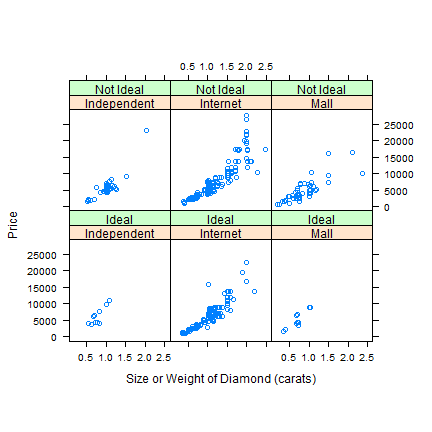
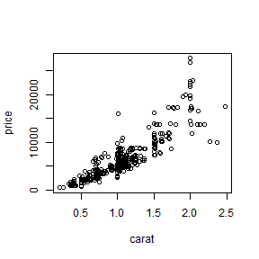

1. Introduction
===============
The purpose of this project is to build a model that predicts the price of a diamond based on a number of variables. According to the project description:

_"This individual assignment asks students to use a training-and-test regimen to compare alternative regression methods, such as, traditional multiple regression, tree-structured regression, and neural networks."_

As such, the focus of this project will be on prediction accuracy and less on inferential studies.

2. Dataset
==========
This dataset consists of 7 variables. The target variable we are aiming for is __price__, a continuous integer. Our __6 explanatory variables__ are split into 2 categories: diamond characteristic and diamond vendor. The diamond characteristics are stated in the project description as the 4Cs: carat, color, clarity, and cut. In total there are __425 obervations__ in this dataset.

3. Analysis & Results
=====================
3.1 Data Preparation
---------------
### 3.1.1 Import Data
First we import the data via the provided CSV file.

```r
diamonds <- read.csv("two_months_salary.csv")
```

Let's take a quick look at the data:

```r
head(diamonds)
```

```
##   carat color clarity       cut     channel    store price
## 1 0.826     4       7     Ideal Independent Goodmans  7775
## 2 0.996     5       6     Ideal Independent Goodmans  9850
## 3 1.070     4       7     Ideal Independent Goodmans 10950
## 4 1.070     7       7 Not Ideal Independent Goodmans  7500
## 5 1.010     8       6 Not Ideal Independent Goodmans  6995
## 6 0.660     3       4     Ideal Independent Goodmans  6100
```

```r
str(diamonds)
```

```
## 'data.frame':	425 obs. of  7 variables:
##  $ carat  : num  0.826 0.996 1.07 1.07 1.01 0.66 0.701 0.97 0.74 2.04 ...
##  $ color  : int  4 5 4 7 8 3 4 8 1 5 ...
##  $ clarity: int  7 6 7 7 6 4 8 6 9 6 ...
##  $ cut    : Factor w/ 2 levels "Ideal","Not Ideal": 1 1 1 2 2 1 1 2 2 2 ...
##  $ channel: Factor w/ 3 levels "Independent",..: 1 1 1 1 1 1 1 1 1 1 ...
##  $ store  : Factor w/ 12 levels "Ashford","Ausmans",..: 7 7 7 7 7 7 7 7 7 7 ...
##  $ price  : int  7775 9850 10950 7500 6995 6100 6300 4850 5895 23000 ...
```

```r
summary(diamonds)
```

```
##      carat          color         clarity             cut     
##  Min.   :0.20   Min.   :1.00   Min.   : 2.00   Ideal    :154  
##  1st Qu.:0.72   1st Qu.:3.00   1st Qu.: 5.00   Not Ideal:271  
##  Median :1.02   Median :4.00   Median : 6.00                  
##  Mean   :1.04   Mean   :4.31   Mean   : 6.13                  
##  3rd Qu.:1.21   3rd Qu.:6.00   3rd Qu.: 7.00                  
##  Max.   :2.48   Max.   :9.00   Max.   :10.00                  
##                                                               
##         channel           store         price      
##  Independent: 48   Blue Nile :211   Min.   :  497  
##  Internet   :318   Ashford   :107   1st Qu.: 3430  
##  Mall       : 59   Riddles   : 16   Median : 5476  
##                    Fred Meyer: 15   Mean   : 6356  
##                    Kay       : 14   3rd Qu.: 7792  
##                    University: 13   Max.   :27575  
##                    (Other)   : 49
```

We can see above that all __7 variables__ are present, the __datatypes have been set__ properly, and __there are no missing values__.

### 3.1.2 Data Modification
According to the provided analysis, it will be helpful to derive some variables initially. These variables specifically are __logprice__ (log transformation of the price variable) and __internet__ (whether or not the vendor is an online vendor). 

```r
diamonds$logprice <- log(diamonds$price)
diamonds$internet <- ifelse((diamonds$channel == "Internet"), 2, 1)
diamonds$internet <- factor(diamonds$internet, levels = c(1, 2), labels = c("NO", 
    "YES"))
```

Let's take a look at the dataset again to verify the additions:

```r
str(diamonds)
```

```
## 'data.frame':	425 obs. of  9 variables:
##  $ carat   : num  0.826 0.996 1.07 1.07 1.01 0.66 0.701 0.97 0.74 2.04 ...
##  $ color   : int  4 5 4 7 8 3 4 8 1 5 ...
##  $ clarity : int  7 6 7 7 6 4 8 6 9 6 ...
##  $ cut     : Factor w/ 2 levels "Ideal","Not Ideal": 1 1 1 2 2 1 1 2 2 2 ...
##  $ channel : Factor w/ 3 levels "Independent",..: 1 1 1 1 1 1 1 1 1 1 ...
##  $ store   : Factor w/ 12 levels "Ashford","Ausmans",..: 7 7 7 7 7 7 7 7 7 7 ...
##  $ price   : int  7775 9850 10950 7500 6995 6100 6300 4850 5895 23000 ...
##  $ logprice: num  8.96 9.2 9.3 8.92 8.85 ...
##  $ internet: Factor w/ 2 levels "NO","YES": 1 1 1 1 1 1 1 1 1 1 ...
```


3.2 Graphical Summary
---------------------
### 3.2.1 Provided Analysis
The graphical summary code was provided to us in advance. The code and the analysis are shown below:

```r
library(lattice)
```

```
## Warning: package 'lattice' was built under R version 3.0.3
```

```r
xyplot(jitter(price) ~ jitter(carat) | channel + cut, data = diamonds, aspect = 1, 
    layout = c(3, 2), strip = function(...) strip.default(..., style = 1), xlab = "Size or Weight of Diamond (carats)", 
    ylab = "Price")
```

 

To summarize the provided analyses:
- price and carat are numeric variables with a strong relationship
- cut and channel are factor variables related to price

### 3.2.2 Multivariate EDA on Price
It may also help to analyze each explanatory variable and its relationship to the target variable, price. First let's load the ggplot2 package as well.

```r
# library(ggplot2)
attach(diamonds)  # attach dataset for easier selection
```


#### 3.2.2.1 Carat

```r
plot(carat, price)
```

 

It looks as if there's a __linear relationship between carat and price__. However, the price spreads out quite a bit as the carat number increases so this relationships is not for certain.


```r
detach(diamonds)
```


3.3 Modeling: Iteration 1
-------------------------
The first model we will apply is a mulitple regression. This method is quick, easy, and will provide us 
