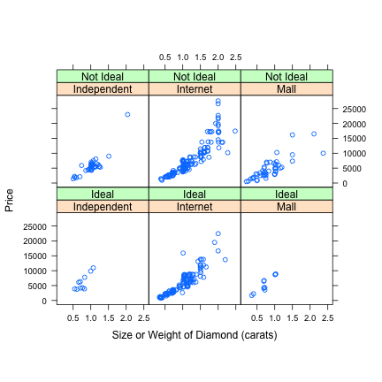
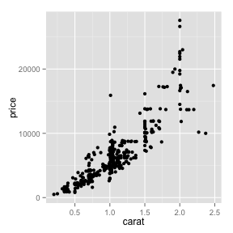
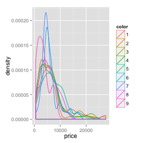
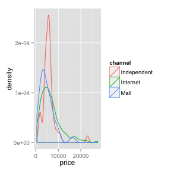
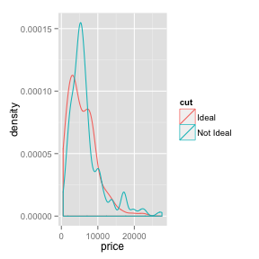
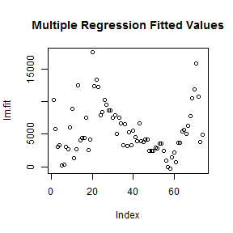
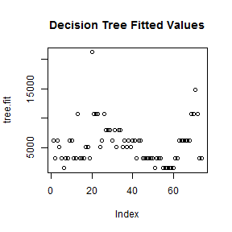

1. Introduction
===============
The purpose of this project is to build a model that predicts the price of a diamond based on a number of variables. According to the project description:

_"This individual assignment asks students to use a training-and-test regimen to compare alternative regression methods, such as, traditional multiple regression, tree-structured regression, and neural networks."_

As such, the focus of this project will be on prediction accuracy and less on inferential studies.

2. Dataset
==========
This dataset consists of 7 variables. The target variable we are aiming for is __price__, a continuous integer. Our __6 explanatory variables__ are split into 2 categories: diamond characteristic and diamond vendor. The diamond characteristics are stated in the project description as the 4Cs: carat, color, clarity, and cut. In total there are __425 obervations__ in this dataset.

3. Analysis & Results
=====================
3.1 Data Preparation
---------------
### 3.1.1 Import Data
First we import the data via the provided CSV file.

```r
diamonds <- read.csv("two_months_salary.csv")
```

Let's take a quick look at the data:

```r
head(diamonds)
```

```
##   carat color clarity       cut     channel    store price
## 1 0.826     4       7     Ideal Independent Goodmans  7775
## 2 0.996     5       6     Ideal Independent Goodmans  9850
## 3 1.070     4       7     Ideal Independent Goodmans 10950
## 4 1.070     7       7 Not Ideal Independent Goodmans  7500
## 5 1.010     8       6 Not Ideal Independent Goodmans  6995
## 6 0.660     3       4     Ideal Independent Goodmans  6100
```

```r
str(diamonds)
```

```
## 'data.frame':	425 obs. of  7 variables:
##  $ carat  : num  0.826 0.996 1.07 1.07 1.01 0.66 0.701 0.97 0.74 2.04 ...
##  $ color  : int  4 5 4 7 8 3 4 8 1 5 ...
##  $ clarity: int  7 6 7 7 6 4 8 6 9 6 ...
##  $ cut    : Factor w/ 2 levels "Ideal","Not Ideal": 1 1 1 2 2 1 1 2 2 2 ...
##  $ channel: Factor w/ 3 levels "Independent",..: 1 1 1 1 1 1 1 1 1 1 ...
##  $ store  : Factor w/ 12 levels "Ashford","Ausmans",..: 7 7 7 7 7 7 7 7 7 7 ...
##  $ price  : int  7775 9850 10950 7500 6995 6100 6300 4850 5895 23000 ...
```

```r
summary(diamonds)
```

```
##      carat          color         clarity             cut     
##  Min.   :0.20   Min.   :1.00   Min.   : 2.00   Ideal    :154  
##  1st Qu.:0.72   1st Qu.:3.00   1st Qu.: 5.00   Not Ideal:271  
##  Median :1.02   Median :4.00   Median : 6.00                  
##  Mean   :1.04   Mean   :4.31   Mean   : 6.13                  
##  3rd Qu.:1.21   3rd Qu.:6.00   3rd Qu.: 7.00                  
##  Max.   :2.48   Max.   :9.00   Max.   :10.00                  
##                                                               
##         channel           store         price      
##  Independent: 48   Blue Nile :211   Min.   :  497  
##  Internet   :318   Ashford   :107   1st Qu.: 3430  
##  Mall       : 59   Riddles   : 16   Median : 5476  
##                    Fred Meyer: 15   Mean   : 6356  
##                    Kay       : 14   3rd Qu.: 7792  
##                    University: 13   Max.   :27575  
##                    (Other)   : 49
```

We can see above that all __7 variables__ are present and __there are no missing values__. However, the __datatypes have not been set__ properly, specifically "color" and "clarity". Let's take care of this now.

```r
diamonds$color <- as.factor(diamonds$color)
diamonds$clarity <- as.factor(diamonds$clarity)
```


### 3.1.2 Data Modification
According to the provided analysis, it will be helpful to derive some variables initially. These variables specifically are __logprice__ (log transformation of the price variable) and __internet__ (whether or not the vendor is an online vendor). 

```r
diamonds$logprice <- log(diamonds$price)
diamonds$internet <- ifelse((diamonds$channel == "Internet"), 2, 1)
diamonds$internet <- factor(diamonds$internet, levels = c(1, 2), labels = c("NO", 
    "YES"))
```

Let's take a look at the dataset again to verify the additions:

```r
str(diamonds)
```

```
## 'data.frame':	425 obs. of  9 variables:
##  $ carat   : num  0.826 0.996 1.07 1.07 1.01 0.66 0.701 0.97 0.74 2.04 ...
##  $ color   : Factor w/ 9 levels "1","2","3","4",..: 4 5 4 7 8 3 4 8 1 5 ...
##  $ clarity : Factor w/ 9 levels "2","3","4","5",..: 6 5 6 6 5 3 7 5 8 5 ...
##  $ cut     : Factor w/ 2 levels "Ideal","Not Ideal": 1 1 1 2 2 1 1 2 2 2 ...
##  $ channel : Factor w/ 3 levels "Independent",..: 1 1 1 1 1 1 1 1 1 1 ...
##  $ store   : Factor w/ 12 levels "Ashford","Ausmans",..: 7 7 7 7 7 7 7 7 7 7 ...
##  $ price   : int  7775 9850 10950 7500 6995 6100 6300 4850 5895 23000 ...
##  $ logprice: num  8.96 9.2 9.3 8.92 8.85 ...
##  $ internet: Factor w/ 2 levels "NO","YES": 1 1 1 1 1 1 1 1 1 1 ...
```


3.2 Graphical Summary
---------------------
### 3.2.1 Provided Analysis
The graphical summary code was provided to us in advance. The code and the analysis are shown below:

```r
library(lattice)
xyplot(jitter(price) ~ jitter(carat) | channel + cut, data = diamonds, aspect = 1, 
    layout = c(3, 2), strip = function(...) strip.default(..., style = 1), xlab = "Size or Weight of Diamond (carats)", 
    ylab = "Price")
```

 

To summarize the analyses provided with the project:
- price and carat are numeric variables with a strong relationship
- cut and channel are factor variables related to price

### 3.2.2 Multivariate EDA on Price
It may also help to analyze each explanatory variable and its relationship to the target variable, price. For this portion we will be using the ggplot2 package as well as the default plotting system.

```r
library(ggplot2)
```

```
## 
## Attaching package: 'ggplot2'
## 
## The following object is masked _by_ '.GlobalEnv':
## 
##     diamonds
```

```r
attach(diamonds)  # attach dataset for easier selection
```

**Carat**

```r
qplot(carat, price)
```

 

It looks as if there's a **linear relationship between carat and price**. However, the price spreads out quite a bit as the carat number increases so this relationships is not for certain.

**Color**

```r
plot(color, price, xlab = "color", ylab = "price")
```

 

```r
ggplot(diamonds, aes(x = price, colour = color)) + geom_density()
```

 

There doesn't seem to be much of a relationship between color and price according to these plots.

**Clarity**

```r
plot(clarity, price, xlab = "clarity", ylab = "price")
```

 

```r
ggplot(diamonds, aes(x = price, colour = channel)) + geom_density()
```

 

While we would expect the price to be higher when clarity is better (i.e. closer to 1), this relationship is not obviously evident in the plots above.

**Cut**

```r
plot(cut, price, xlab = "cut", ylab = "price")
```

 

```r
ggplot(diamonds, aes(x = price, colour = cut)) + geom_density()
```

 

Again there's no immediate distinction in prices between the classes here.

**Channel**

```r
plot(channel, price, xlab = "channel", ylab = "price")
```

 

```r
ggplot(diamonds, aes(x = price, colour = channel)) + geom_density()
```

 

And no clear distinction between the prices here either.

**Summary**  
Besides carat none of the other variables have a clear and obvious impact on the price of the diamond.


```r
detach(diamonds)
```


3.3 Modeling Preparation
------------------------
### Split Test/Train datasets
Before we begin modeling, let's split out the testing and training datasets at a 20/80 split.

```r
rand <- sample(1:5, nrow(diamonds), replace = T)
train <- diamonds[rand < 5, ]
test <- diamonds[rand == 5, ]
```


3.4 Modeling
------------
### 3.4.1 Multiple Regression
The first method we will apply is a multiple regression. We will start off with 1st order relationships between the varialbes. This method is quick, easy, and will provide us with some useful insights.

```r
lm <- lm(price ~ carat + color + clarity + cut + channel + store, train)
lm.fit <- predict(lm, test)
```

```
## Warning: prediction from a rank-deficient fit may be misleading
```

```r
lm.results <- cbind(test$price, lm.fit)
lm.rmse <- sqrt(mean((lm.results[, 2] - lm.results[, 1])^2))
print(lm.rmse)
```

```
## [1] 1516
```

**Results**  
As we see above, the stock multiple regression gives us an RMSE of **1516.2657**. This is without any adjustments to the formula, no outlier removal, or any other modifications to the data. This value will provide a baseline to compare the other methods to.

### 3.4.2 Decision Tree
In addition to multiple regressions, the project also recommends using a tree-structured regression as a method of prediction. The decision tree is usually used for classification, or in other words the prediction of nominal variables. However, we can apply the tree and see how it performs compared to the stock multiple regression.

```r
library(rpart)
tree <- rpart(price ~ carat + color + clarity + cut + channel + store, data = train)
tree.fit <- predict(tree, test)
tree.results <- cbind(test$price, tree.fit)
tree.rmse <- sqrt(mean((tree.results[, 2] - tree.results[, 1])^2))
print(tree.rmse)
```

```
## [1] 1864
```

**Results**  
When using the decision tree, our resulting RMSE when predicting the test dataset is **1864.3306**. This number is greater than the RMSE from the multiple regression. This should not be surprising given that the decision tree is a classifier. Let's look at the respective plots for both of the models to really see the difference:

```r
plot(lm.fit, main = "Multiple Regression Fitted Values")
```

 

```r
plot(tree.fit, main = "Decision Tree Fitted Values")
```

 

In the decision tree plot we can see that the values fall into distinct lines. This is because decision trees, as classifiers, output only nominal values. As a result, the residuals will generally be greater than that of the multiple regression model.

4. Conclusion
=============
For this project we were tasked with predicting the price of a diamond based on 6 explanatory variables. We used two methods for this: multiple regression and decision trees. The multiple regression model is the first choice for this type of problem due to its output of continuous variables. We used this method as the baseline. The second method we used is the decision tree. This method is primarily used for classification problems, so its application to this project is purely to test its performance.

The results of the two models are not surprising. The linear regression had an RMSE of 1516.2657 and the decision tree had a higher RMSE of 1864.3306. These RMSE of the decision tree is understandably higher than that of the linear regression because the decision tree cannot output continuous variables. As a result, there are inherent errors introduced when we apply the tree to this type of problem.
