Prompt
======
This individual assignment asks students to use a statistical experiment to compare alternative classification methods. Students are encouraged to install packages with data-adaptive, machine learning algorithms. Ensemble methods (committee machines) may also be employed. Various criteria, tabular, and graphical (including receiver operating characteristic curves) are used for evaluating classifiers. Try at least one traditional and one machine learning method.

1. Load Preparation
===================

```r
library(MMST)
data(spambase)
```


2. EDA
======

```r
str(spambase)
```

```
## 'data.frame':	4601 obs. of  59 variables:
##  $ make      : num  0 0.21 0.06 0 0 0 0 0 0.15 0.06 ...
##  $ address   : num  0.64 0.28 0 0 0 0 0 0 0 0.12 ...
##  $ all       : num  0.64 0.5 0.71 0 0 0 0 0 0.46 0.77 ...
##  $ xd        : num  0 0 0 0 0 0 0 0 0 0 ...
##  $ our       : num  0.32 0.14 1.23 0.63 0.63 1.85 1.92 1.88 0.61 0.19 ...
##  $ over      : num  0 0.28 0.19 0 0 0 0 0 0 0.32 ...
##  $ remove    : num  0 0.21 0.19 0.31 0.31 0 0 0 0.3 0.38 ...
##  $ internet  : num  0 0.07 0.12 0.63 0.63 1.85 0 1.88 0 0 ...
##  $ order     : num  0 0 0.64 0.31 0.31 0 0 0 0.92 0.06 ...
##  $ mail      : num  0 0.94 0.25 0.63 0.63 0 0.64 0 0.76 0 ...
##  $ receive   : num  0 0.21 0.38 0.31 0.31 0 0.96 0 0.76 0 ...
##  $ will      : num  0.64 0.79 0.45 0.31 0.31 0 1.28 0 0.92 0.64 ...
##  $ people    : num  0 0.65 0.12 0.31 0.31 0 0 0 0 0.25 ...
##  $ report    : num  0 0.21 0 0 0 0 0 0 0 0 ...
##  $ addresses : num  0 0.14 1.75 0 0 0 0 0 0 0.12 ...
##  $ free      : num  0.32 0.14 0.06 0.31 0.31 0 0.96 0 0 0 ...
##  $ business  : num  0 0.07 0.06 0 0 0 0 0 0 0 ...
##  $ email     : num  1.29 0.28 1.03 0 0 0 0.32 0 0.15 0.12 ...
##  $ you       : num  1.93 3.47 1.36 3.18 3.18 0 3.85 0 1.23 1.67 ...
##  $ credit    : num  0 0 0.32 0 0 0 0 0 3.53 0.06 ...
##  $ your      : num  0.96 1.59 0.51 0.31 0.31 0 0.64 0 2 0.71 ...
##  $ font      : num  0 0 0 0 0 0 0 0 0 0 ...
##  $ x000      : num  0 0.43 1.16 0 0 0 0 0 0 0.19 ...
##  $ money     : num  0 0.43 0.06 0 0 0 0 0 0.15 0 ...
##  $ hp        : num  0 0 0 0 0 0 0 0 0 0 ...
##  $ hpl       : num  0 0 0 0 0 0 0 0 0 0 ...
##  $ george    : num  0 0 0 0 0 0 0 0 0 0 ...
##  $ x650      : num  0 0 0 0 0 0 0 0 0 0 ...
##  $ lab       : num  0 0 0 0 0 0 0 0 0 0 ...
##  $ labs      : num  0 0 0 0 0 0 0 0 0 0 ...
##  $ telnet    : num  0 0 0 0 0 0 0 0 0 0 ...
##  $ x857      : num  0 0 0 0 0 0 0 0 0 0 ...
##  $ data      : num  0 0 0 0 0 0 0 0 0.15 0 ...
##  $ x415      : num  0 0 0 0 0 0 0 0 0 0 ...
##  $ x85       : num  0 0 0 0 0 0 0 0 0 0 ...
##  $ technology: num  0 0 0 0 0 0 0 0 0 0 ...
##  $ x1999     : num  0 0.07 0 0 0 0 0 0 0 0 ...
##  $ parts     : num  0 0 0 0 0 0 0 0 0 0 ...
##  $ pm        : num  0 0 0 0 0 0 0 0 0 0 ...
##  $ direct    : num  0 0 0.06 0 0 0 0 0 0 0 ...
##  $ cs        : num  0 0 0 0 0 0 0 0 0 0 ...
##  $ meeting   : num  0 0 0 0 0 0 0 0 0 0 ...
##  $ original  : num  0 0 0.12 0 0 0 0 0 0.3 0 ...
##  $ project   : num  0 0 0 0 0 0 0 0 0 0.06 ...
##  $ re        : num  0 0 0.06 0 0 0 0 0 0 0 ...
##  $ edu       : num  0 0 0.06 0 0 0 0 0 0 0 ...
##  $ table     : num  0 0 0 0 0 0 0 0 0 0 ...
##  $ conference: num  0 0 0 0 0 0 0 0 0 0 ...
##  $ x.        : num  0 0 0.01 0 0 0 0 0 0 0.04 ...
##  $ x..       : num  0 0.132 0.143 0.137 0.135 0.223 0.054 0.206 0.271 0.03 ...
##  $ x...1     : num  0 0 0 0 0 0 0 0 0 0 ...
##  $ x..1      : num  0.778 0.372 0.276 0.137 0.135 0 0.164 0 0.181 0.244 ...
##  $ x..2      : num  0 0.18 0.184 0 0 0 0.054 0 0.203 0.081 ...
##  $ x..3      : num  0 0.048 0.01 0 0 0 0 0 0.022 0 ...
##  $ crla      : num  3.76 5.11 9.82 3.54 3.54 ...
##  $ crll      : int  61 101 485 40 40 15 4 11 445 43 ...
##  $ crrt      : int  278 1028 2259 191 191 54 112 49 1257 749 ...
##  $ classdigit: Factor w/ 2 levels "0","1": 2 2 2 2 2 2 2 2 2 2 ...
##  $ class     : Factor w/ 2 levels "email","spam": 2 2 2 2 2 2 2 2 2 2 ...
```

```r
head(spambase)
```

```
##   make address  all xd  our over remove internet order mail receive will
## 1 0.00    0.64 0.64  0 0.32 0.00   0.00     0.00  0.00 0.00    0.00 0.64
## 2 0.21    0.28 0.50  0 0.14 0.28   0.21     0.07  0.00 0.94    0.21 0.79
## 3 0.06    0.00 0.71  0 1.23 0.19   0.19     0.12  0.64 0.25    0.38 0.45
## 4 0.00    0.00 0.00  0 0.63 0.00   0.31     0.63  0.31 0.63    0.31 0.31
## 5 0.00    0.00 0.00  0 0.63 0.00   0.31     0.63  0.31 0.63    0.31 0.31
## 6 0.00    0.00 0.00  0 1.85 0.00   0.00     1.85  0.00 0.00    0.00 0.00
##   people report addresses free business email  you credit your font x000
## 1   0.00   0.00      0.00 0.32     0.00  1.29 1.93   0.00 0.96    0 0.00
## 2   0.65   0.21      0.14 0.14     0.07  0.28 3.47   0.00 1.59    0 0.43
## 3   0.12   0.00      1.75 0.06     0.06  1.03 1.36   0.32 0.51    0 1.16
## 4   0.31   0.00      0.00 0.31     0.00  0.00 3.18   0.00 0.31    0 0.00
## 5   0.31   0.00      0.00 0.31     0.00  0.00 3.18   0.00 0.31    0 0.00
## 6   0.00   0.00      0.00 0.00     0.00  0.00 0.00   0.00 0.00    0 0.00
##   money hp hpl george x650 lab labs telnet x857 data x415 x85 technology
## 1  0.00  0   0      0    0   0    0      0    0    0    0   0          0
## 2  0.43  0   0      0    0   0    0      0    0    0    0   0          0
## 3  0.06  0   0      0    0   0    0      0    0    0    0   0          0
## 4  0.00  0   0      0    0   0    0      0    0    0    0   0          0
## 5  0.00  0   0      0    0   0    0      0    0    0    0   0          0
## 6  0.00  0   0      0    0   0    0      0    0    0    0   0          0
##   x1999 parts pm direct cs meeting original project   re  edu table
## 1  0.00     0  0   0.00  0       0     0.00       0 0.00 0.00     0
## 2  0.07     0  0   0.00  0       0     0.00       0 0.00 0.00     0
## 3  0.00     0  0   0.06  0       0     0.12       0 0.06 0.06     0
## 4  0.00     0  0   0.00  0       0     0.00       0 0.00 0.00     0
## 5  0.00     0  0   0.00  0       0     0.00       0 0.00 0.00     0
## 6  0.00     0  0   0.00  0       0     0.00       0 0.00 0.00     0
##   conference   x.   x.. x...1  x..1  x..2  x..3  crla crll crrt classdigit
## 1          0 0.00 0.000     0 0.778 0.000 0.000 3.756   61  278          1
## 2          0 0.00 0.132     0 0.372 0.180 0.048 5.114  101 1028          1
## 3          0 0.01 0.143     0 0.276 0.184 0.010 9.821  485 2259          1
## 4          0 0.00 0.137     0 0.137 0.000 0.000 3.537   40  191          1
## 5          0 0.00 0.135     0 0.135 0.000 0.000 3.537   40  191          1
## 6          0 0.00 0.223     0 0.000 0.000 0.000 3.000   15   54          1
##   class
## 1  spam
## 2  spam
## 3  spam
## 4  spam
## 5  spam
## 6  spam
```

```r
summary(spambase)
```

```
##       make          address            all              xd       
##  Min.   :0.000   Min.   : 0.000   Min.   :0.000   Min.   : 0.00  
##  1st Qu.:0.000   1st Qu.: 0.000   1st Qu.:0.000   1st Qu.: 0.00  
##  Median :0.000   Median : 0.000   Median :0.000   Median : 0.00  
##  Mean   :0.105   Mean   : 0.213   Mean   :0.281   Mean   : 0.07  
##  3rd Qu.:0.000   3rd Qu.: 0.000   3rd Qu.:0.420   3rd Qu.: 0.00  
##  Max.   :4.540   Max.   :14.280   Max.   :5.100   Max.   :42.81  
##       our              over           remove         internet     
##  Min.   : 0.000   Min.   :0.000   Min.   :0.000   Min.   : 0.000  
##  1st Qu.: 0.000   1st Qu.:0.000   1st Qu.:0.000   1st Qu.: 0.000  
##  Median : 0.000   Median :0.000   Median :0.000   Median : 0.000  
##  Mean   : 0.312   Mean   :0.096   Mean   :0.114   Mean   : 0.105  
##  3rd Qu.: 0.380   3rd Qu.:0.000   3rd Qu.:0.000   3rd Qu.: 0.000  
##  Max.   :10.000   Max.   :5.880   Max.   :7.270   Max.   :11.110  
##      order           mail           receive            will      
##  Min.   :0.00   Min.   : 0.000   Min.   :0.0000   Min.   :0.000  
##  1st Qu.:0.00   1st Qu.: 0.000   1st Qu.:0.0000   1st Qu.:0.000  
##  Median :0.00   Median : 0.000   Median :0.0000   Median :0.100  
##  Mean   :0.09   Mean   : 0.239   Mean   :0.0598   Mean   :0.542  
##  3rd Qu.:0.00   3rd Qu.: 0.160   3rd Qu.:0.0000   3rd Qu.:0.800  
##  Max.   :5.26   Max.   :18.180   Max.   :2.6100   Max.   :9.670  
##      people          report         addresses          free       
##  Min.   :0.000   Min.   : 0.000   Min.   :0.000   Min.   : 0.000  
##  1st Qu.:0.000   1st Qu.: 0.000   1st Qu.:0.000   1st Qu.: 0.000  
##  Median :0.000   Median : 0.000   Median :0.000   Median : 0.000  
##  Mean   :0.094   Mean   : 0.059   Mean   :0.049   Mean   : 0.249  
##  3rd Qu.:0.000   3rd Qu.: 0.000   3rd Qu.:0.000   3rd Qu.: 0.100  
##  Max.   :5.550   Max.   :10.000   Max.   :4.410   Max.   :20.000  
##     business         email            you            credit      
##  Min.   :0.000   Min.   :0.000   Min.   : 0.00   Min.   : 0.000  
##  1st Qu.:0.000   1st Qu.:0.000   1st Qu.: 0.00   1st Qu.: 0.000  
##  Median :0.000   Median :0.000   Median : 1.31   Median : 0.000  
##  Mean   :0.143   Mean   :0.185   Mean   : 1.66   Mean   : 0.086  
##  3rd Qu.:0.000   3rd Qu.:0.000   3rd Qu.: 2.64   3rd Qu.: 0.000  
##  Max.   :7.140   Max.   :9.090   Max.   :18.75   Max.   :18.180  
##       your            font             x000           money       
##  Min.   : 0.00   Min.   : 0.000   Min.   :0.000   Min.   : 0.000  
##  1st Qu.: 0.00   1st Qu.: 0.000   1st Qu.:0.000   1st Qu.: 0.000  
##  Median : 0.22   Median : 0.000   Median :0.000   Median : 0.000  
##  Mean   : 0.81   Mean   : 0.121   Mean   :0.102   Mean   : 0.094  
##  3rd Qu.: 1.27   3rd Qu.: 0.000   3rd Qu.:0.000   3rd Qu.: 0.000  
##  Max.   :11.11   Max.   :17.100   Max.   :5.450   Max.   :12.500  
##        hp             hpl             george           x650      
##  Min.   : 0.00   Min.   : 0.000   Min.   : 0.00   Min.   :0.000  
##  1st Qu.: 0.00   1st Qu.: 0.000   1st Qu.: 0.00   1st Qu.:0.000  
##  Median : 0.00   Median : 0.000   Median : 0.00   Median :0.000  
##  Mean   : 0.55   Mean   : 0.265   Mean   : 0.77   Mean   :0.125  
##  3rd Qu.: 0.00   3rd Qu.: 0.000   3rd Qu.: 0.00   3rd Qu.:0.000  
##  Max.   :20.83   Max.   :16.660   Max.   :33.33   Max.   :9.090  
##       lab              labs           telnet            x857      
##  Min.   : 0.000   Min.   :0.000   Min.   : 0.000   Min.   :0.000  
##  1st Qu.: 0.000   1st Qu.:0.000   1st Qu.: 0.000   1st Qu.:0.000  
##  Median : 0.000   Median :0.000   Median : 0.000   Median :0.000  
##  Mean   : 0.099   Mean   :0.103   Mean   : 0.065   Mean   :0.047  
##  3rd Qu.: 0.000   3rd Qu.:0.000   3rd Qu.: 0.000   3rd Qu.:0.000  
##  Max.   :14.280   Max.   :5.880   Max.   :12.500   Max.   :4.760  
##       data             x415            x85           technology   
##  Min.   : 0.000   Min.   :0.000   Min.   : 0.000   Min.   :0.000  
##  1st Qu.: 0.000   1st Qu.:0.000   1st Qu.: 0.000   1st Qu.:0.000  
##  Median : 0.000   Median :0.000   Median : 0.000   Median :0.000  
##  Mean   : 0.097   Mean   :0.048   Mean   : 0.105   Mean   :0.097  
##  3rd Qu.: 0.000   3rd Qu.:0.000   3rd Qu.: 0.000   3rd Qu.:0.000  
##  Max.   :18.180   Max.   :4.760   Max.   :20.000   Max.   :7.690  
##      x1999           parts             pm             direct     
##  Min.   :0.000   Min.   :0.000   Min.   : 0.000   Min.   :0.000  
##  1st Qu.:0.000   1st Qu.:0.000   1st Qu.: 0.000   1st Qu.:0.000  
##  Median :0.000   Median :0.000   Median : 0.000   Median :0.000  
##  Mean   :0.137   Mean   :0.013   Mean   : 0.079   Mean   :0.065  
##  3rd Qu.:0.000   3rd Qu.:0.000   3rd Qu.: 0.000   3rd Qu.:0.000  
##  Max.   :6.890   Max.   :8.330   Max.   :11.110   Max.   :4.760  
##        cs           meeting          original        project      
##  Min.   :0.000   Min.   : 0.000   Min.   :0.000   Min.   : 0.000  
##  1st Qu.:0.000   1st Qu.: 0.000   1st Qu.:0.000   1st Qu.: 0.000  
##  Median :0.000   Median : 0.000   Median :0.000   Median : 0.000  
##  Mean   :0.044   Mean   : 0.132   Mean   :0.046   Mean   : 0.079  
##  3rd Qu.:0.000   3rd Qu.: 0.000   3rd Qu.:0.000   3rd Qu.: 0.000  
##  Max.   :7.140   Max.   :14.280   Max.   :3.570   Max.   :20.000  
##        re              edu            table          conference    
##  Min.   : 0.000   Min.   : 0.00   Min.   :0.0000   Min.   : 0.000  
##  1st Qu.: 0.000   1st Qu.: 0.00   1st Qu.:0.0000   1st Qu.: 0.000  
##  Median : 0.000   Median : 0.00   Median :0.0000   Median : 0.000  
##  Mean   : 0.301   Mean   : 0.18   Mean   :0.0054   Mean   : 0.032  
##  3rd Qu.: 0.110   3rd Qu.: 0.00   3rd Qu.:0.0000   3rd Qu.: 0.000  
##  Max.   :21.420   Max.   :22.05   Max.   :2.1700   Max.   :10.000  
##        x.             x..            x...1            x..1      
##  Min.   :0.000   Min.   :0.000   Min.   :0.000   Min.   : 0.00  
##  1st Qu.:0.000   1st Qu.:0.000   1st Qu.:0.000   1st Qu.: 0.00  
##  Median :0.000   Median :0.065   Median :0.000   Median : 0.00  
##  Mean   :0.039   Mean   :0.139   Mean   :0.017   Mean   : 0.27  
##  3rd Qu.:0.000   3rd Qu.:0.188   3rd Qu.:0.000   3rd Qu.: 0.32  
##  Max.   :4.385   Max.   :9.752   Max.   :4.081   Max.   :32.48  
##       x..2            x..3             crla             crll     
##  Min.   :0.000   Min.   : 0.000   Min.   :   1.0   Min.   :   1  
##  1st Qu.:0.000   1st Qu.: 0.000   1st Qu.:   1.6   1st Qu.:   6  
##  Median :0.000   Median : 0.000   Median :   2.3   Median :  15  
##  Mean   :0.076   Mean   : 0.044   Mean   :   5.2   Mean   :  52  
##  3rd Qu.:0.052   3rd Qu.: 0.000   3rd Qu.:   3.7   3rd Qu.:  43  
##  Max.   :6.003   Max.   :19.829   Max.   :1102.5   Max.   :9989  
##       crrt       classdigit   class     
##  Min.   :    1   0:2788     email:2788  
##  1st Qu.:   35   1:1813     spam :1813  
##  Median :   95                          
##  Mean   :  283                          
##  3rd Qu.:  266                          
##  Max.   :15841
```


## 2.1 Between Explanatory Vars
Let's look at the relationships using a correlogram. Due to the large sample size, it might be best to take a smaller sample first to not kill the machine.

```r
require(corrgram)
```

```
## Loading required package: corrgram
## Loading required package: seriation
```

```r
mask <- sample(c(T, F), nrow(spambase), replace = T, prob = c(0.1, 0.9))
temp <- spambase[mask, ]
corrgram(temp, upper.panel = panel.conf, lower.panel = panel.pie)
```

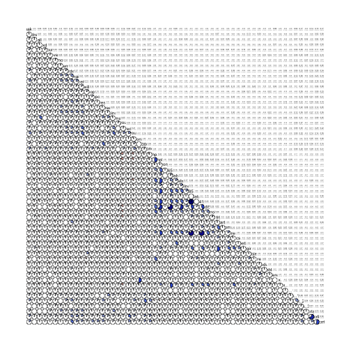 

There seems to be heavy multicollinearity between x857 through technology (minus data). Especially concerning is the relationship between "x857" and "x415". Let's run a correlogram on this smaller slice using the full dataset.

```r
corrgram(spambase[, 25:40], upper.panel = panel.conf, lower.panel = panel.pie)
```

 

We see that "x857" and "x415" are indeed 1:1 correlated with one another. It doesn't makes sense to keep this redundancy.

***Aside: Remove detected redundancy***

```r
spambase <- spambase[, -34]
```


Still, there remains some strong correlations within multiple variables. Let's keep this in mind while we continue exploring the data.

## Vs Target

```r
require(ggplot2)
```

```
## Loading required package: ggplot2
```

```r
for (i in 1:nrow(temp)) {
    p <- ggplot(temp, aes(x = temp[, i], fill = class, alpha = 0.5)) + geom_density() + 
        labs(title = names(temp)[i], x = names(temp)[i])
    print(p)
}
```

 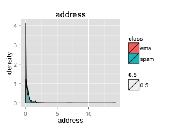 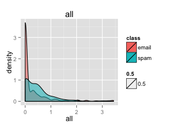                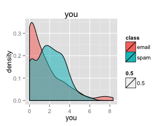      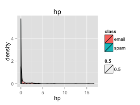 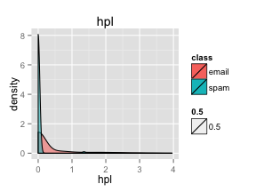   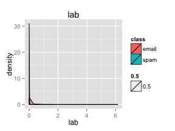 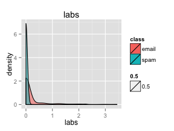 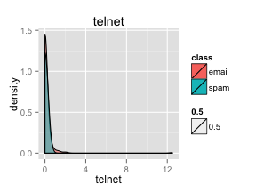    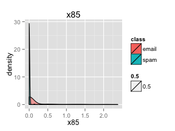  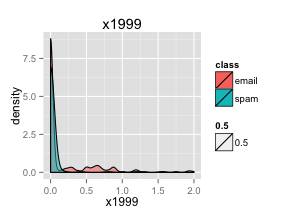 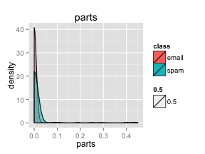   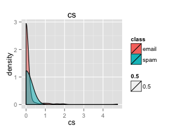  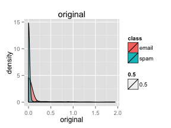  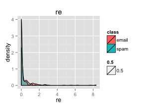       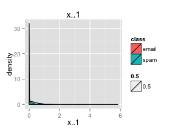   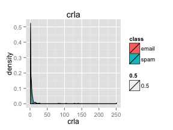     

```
## Error: undefined columns selected
```

There seems to be some variables that have different densities between the classes. These variables may be useful when put into the classification models.


3. Modeling Iter. 1
===================
3.1 Split Test/Train
--------------------

```r
mask <- sample(c(T, F), nrow(spambase), replace = T, prob = c(0.8, 0.2))
train <- spambase[mask, ]
test <- spambase[!mask, ]
```

Are there enough test cases in the test set?

```r
table(test$class)
```

```
## 
## email  spam 
##   547   375
```

There are.

3.2 Logistic Regression
-----------------------
### 3.2.1 Fit the model

```r
fit <- glm(class ~ ., family = binomial, train[-57])
```

```
## Warning: glm.fit: fitted probabilities numerically 0 or 1 occurred
```

```r
summary(fit)
```

```
## 
## Call:
## glm(formula = class ~ ., family = binomial, data = train[-57])
## 
## Deviance Residuals: 
##    Min      1Q  Median      3Q     Max  
##  -3.91   -0.21    0.00    0.13    5.21  
## 
## Coefficients:
##              Estimate Std. Error z value Pr(>|z|)    
## (Intercept) -1.40e+00   1.53e-01   -9.20  < 2e-16 ***
## make        -2.21e-01   2.42e-01   -0.92  0.35973    
## address     -1.52e-01   7.60e-02   -2.00  0.04594 *  
## all          1.05e-01   1.31e-01    0.80  0.42569    
## xd           2.82e+00   1.86e+00    1.51  0.13028    
## our          5.14e-01   1.11e-01    4.62  3.8e-06 ***
## over         1.46e+00   3.12e-01    4.67  3.0e-06 ***
## remove       1.99e+00   3.30e-01    6.05  1.5e-09 ***
## internet     5.82e-01   1.90e-01    3.07  0.00214 ** 
## order        6.17e-01   2.99e-01    2.06  0.03911 *  
## mail         9.40e-02   7.39e-02    1.27  0.20346    
## receive     -4.87e-01   3.32e-01   -1.46  0.14296    
## will        -1.44e-01   7.95e-02   -1.81  0.07042 .  
## people      -2.86e-02   2.43e-01   -0.12  0.90618    
## report       1.28e-01   1.46e-01    0.88  0.38023    
## addresses    1.79e+00   1.05e+00    1.70  0.08925 .  
## free         1.08e+00   1.60e-01    6.73  1.8e-11 ***
## business     8.58e-01   2.34e-01    3.66  0.00025 ***
## email        1.49e-01   1.23e-01    1.20  0.22850    
## you          5.79e-02   3.78e-02    1.53  0.12612    
## credit       1.01e+00   6.28e-01    1.60  0.10928    
## your         2.33e-01   5.75e-02    4.06  5.0e-05 ***
## font         2.48e-01   1.81e-01    1.37  0.17013    
## x000         2.01e+00   4.47e-01    4.50  6.9e-06 ***
## money        3.30e-01   1.39e-01    2.37  0.01786 *  
## hp          -1.94e+00   3.59e-01   -5.41  6.3e-08 ***
## hpl         -1.03e+00   5.10e-01   -2.02  0.04370 *  
## george      -1.10e+01   2.16e+00   -5.11  3.2e-07 ***
## x650         8.05e-01   3.16e-01    2.55  0.01086 *  
## lab         -2.41e+00   1.50e+00   -1.60  0.10853    
## labs        -2.88e-01   3.39e-01   -0.85  0.39688    
## telnet      -1.48e-01   4.01e-01   -0.37  0.71232    
## x857         2.78e+00   3.31e+00    0.84  0.40042    
## data        -7.17e-01   3.19e-01   -2.25  0.02473 *  
## x85         -2.08e+00   7.77e-01   -2.67  0.00759 ** 
## technology   8.73e-01   3.56e-01    2.45  0.01410 *  
## x1999       -1.30e-02   2.06e-01   -0.06  0.94967    
## parts        1.14e+00   1.03e+00    1.10  0.27145    
## pm          -7.84e-01   3.76e-01   -2.08  0.03737 *  
## direct      -3.09e-01   3.77e-01   -0.82  0.41271    
## cs          -4.18e+01   2.88e+01   -1.45  0.14621    
## meeting     -2.86e+00   9.23e-01   -3.10  0.00194 ** 
## original    -1.35e+00   9.38e-01   -1.44  0.14976    
## project     -1.63e+00   6.35e-01   -2.56  0.01045 *  
## re          -8.78e-01   1.80e-01   -4.88  1.0e-06 ***
## edu         -1.30e+00   2.84e-01   -4.57  5.0e-06 ***
## table       -1.68e+00   1.32e+00   -1.27  0.20486    
## conference  -3.86e+00   1.77e+00   -2.19  0.02870 *  
## x.          -1.38e+00   5.08e-01   -2.72  0.00661 ** 
## x..         -6.14e-01   3.86e-01   -1.59  0.11162    
## x...1       -6.63e-01   8.25e-01   -0.80  0.42136    
## x..1         2.99e-01   8.19e-02    3.65  0.00026 ***
## x..2         4.88e+00   7.13e-01    6.84  7.9e-12 ***
## x..3         2.36e+00   1.16e+00    2.04  0.04116 *  
## crla         6.08e-03   1.94e-02    0.31  0.75446    
## crll         9.23e-03   2.66e-03    3.47  0.00053 ***
## crrt         6.73e-04   2.32e-04    2.90  0.00367 ** 
## ---
## Signif. codes:  0 '***' 0.001 '**' 0.01 '*' 0.05 '.' 0.1 ' ' 1
## 
## (Dispersion parameter for binomial family taken to be 1)
## 
##     Null deviance: 4923.5  on 3678  degrees of freedom
## Residual deviance: 1508.9  on 3622  degrees of freedom
## AIC: 1623
## 
## Number of Fisher Scoring iterations: 13
```

### 3.2.2 Test the model

```r
fit.pred <- predict(fit, test, type = "response")
```

#### 3.2.2.1 Confusion table using 0.5 cutoff rate

```r
y_hat <- 1 * (fit.pred > 0.5)
t <- table(test$classdigit, y_hat)
addmargins(t)
```

```
##      y_hat
##         0   1 Sum
##   0   528  19 547
##   1    38 337 375
##   Sum 566 356 922
```

It's not too bad. False positive is 22/925 and false negative is 39/925. This is only at 0.5 cutoff though. Let's use an ROC Curve instead.
#### 3.2.2.2 Using ROC Curve

```r
require(ROCR)
```

```
## Loading required package: ROCR
## Loading required package: gplots
## KernSmooth 2.23 loaded
## Copyright M. P. Wand 1997-2009
## 
## Attaching package: 'gplots'
## 
## The following object is masked from 'package:stats':
## 
##     lowess
```

```r
pred <- prediction(fit.pred, test$classdigit)
perf <- performance(pred, "tpr", "fpr")
plot(perf)
```

 

```r
auc.tmp <- performance(pred, "auc")
print(fit.auc <- as.numeric(auc.tmp@y.values))
```

```
## [1] 0.9795
```

The AUC is very solid @ 0.9696

3.3 Decision Tree
-----------------
### 3.3.1 Fit the model

```r
require(rpart)
```

```
## Loading required package: rpart
```

```r
tree <- rpart(class ~ ., train[-57])
tree
```

```
## n= 3679 
## 
## node), split, n, loss, yval, (yprob)
##       * denotes terminal node
## 
##  1) root 3679 1438 email (0.60913 0.39087)  
##    2) x..2< 0.0445 2733  621 email (0.77278 0.22722)  
##      4) remove< 0.055 2500  407 email (0.83720 0.16280)  
##        8) x..1< 0.5235 2258  242 email (0.89283 0.10717) *
##        9) x..1>=0.5235 242   77 spam (0.31818 0.68182)  
##         18) crrt< 24.5 73   17 email (0.76712 0.23288) *
##         19) crrt>=24.5 169   21 spam (0.12426 0.87574) *
##      5) remove>=0.055 233   19 spam (0.08155 0.91845) *
##    3) x..2>=0.0445 946  129 spam (0.13636 0.86364)  
##      6) hp>=0.385 70    6 email (0.91429 0.08571) *
##      7) hp< 0.385 876   65 spam (0.07420 0.92580) *
```

```r
plot(tree)
```

 

### 3.3.2 Test the model

```r
tree.pred <- predict.rpart(tree, test)
```

```
## Error: could not find function "predict.rpart"
```

#### 3.3.2.1 Confusion table

```r
y_hat <- predict(tree, test, type = "class")
t <- table(test$class, y_hat)
addmargins(t)
```

```
##        y_hat
##         email spam Sum
##   email   514   33 547
##   spam     64  311 375
##   Sum     578  344 922
```

The decision tree performs well, but not as well as the logistic regression. It has 45 FP and 48 FN.
#### 3.3.2.2 Using ROC Curve

```r
require(ROCR)
pred <- prediction(as.matrix(tree.pred)[, 2], test$classdigit)
```

```
## Error: object 'tree.pred' not found
```

```r
perf <- performance(pred, "tpr", "fpr")
plot(perf)
```

 

```r
auc.tmp <- performance(pred, "auc")
print(fit.auc <- as.numeric(auc.tmp@y.values))
```

```
## [1] 0.9795
```

The AUC is decently good @ 0.9073

3.4 Random Forest
-----------------
### 3.4.1 Fit the model

```r
require(randomForest)
```

```
## Loading required package: randomForest
## randomForest 4.6-7
## Type rfNews() to see new features/changes/bug fixes.
```

```r
rf <- randomForest(class ~ ., train[-57])
rf
```

```
## 
## Call:
##  randomForest(formula = class ~ ., data = train[-57]) 
##                Type of random forest: classification
##                      Number of trees: 500
## No. of variables tried at each split: 7
## 
##         OOB estimate of  error rate: 4.7%
## Confusion matrix:
##       email spam class.error
## email  2173   68     0.03034
## spam    105 1333     0.07302
```

### 3.4.2 Test the model
#### 3.4.2.1 Confusion table

```r
y_hat <- predict(rf, test)
t <- table(test$class, y_hat)
addmargins(t)
```

```
##        y_hat
##         email spam Sum
##   email   537   10 547
##   spam     24  351 375
##   Sum     561  361 922
```

The random forest performs better than the others, with a FP or 10 and FN of 28.
#### 3.3.2.2 Using ROC Curve

```r
require(ROCR)
rf.pred <- predict(rf, test, type = "prob")
pred <- prediction(as.matrix(rf.pred)[, 2], test$classdigit)
perf <- performance(pred, "tpr", "fpr")
plot(perf)
```

 

```r
auc.tmp <- performance(pred, "auc")
print(fit.auc <- as.numeric(auc.tmp@y.values))
```

```
## [1] 0.988
```

The ROC for the random forest is great with its AUC of 0.9904!


4. Modeling Iter. 2
===================
This time we'll first apply a PCA to the dataset.
4.1 PCA
-------
### 4.1.1 Build PC mappings

```r
pc <- princomp(spambase[, -57:-58])
summary(pc)
```

```
## Importance of components:
##                         Comp.1    Comp.2    Comp.3    Comp.4    Comp.5
## Standard deviation     613.941 169.95779 27.379691 3.377e+00 2.030e+00
## Proportion of Variance   0.927   0.07104  0.001844 2.806e-05 1.013e-05
## Cumulative Proportion    0.927   0.99807  0.999914 9.999e-01 1.000e+00
##                           Comp.6    Comp.7    Comp.8    Comp.9   Comp.10
## Standard deviation     1.617e+00 1.395e+00 1.279e+00 1.155e+00 1.031e+00
## Proportion of Variance 6.427e-06 4.786e-06 4.025e-06 3.281e-06 2.617e-06
## Cumulative Proportion  1.000e+00 1.000e+00 1.000e+00 1.000e+00 1.000e+00
##                          Comp.11   Comp.12   Comp.13   Comp.14   Comp.15
## Standard deviation     1.000e+00 9.253e-01 8.983e-01 8.602e-01 8.242e-01
## Proportion of Variance 2.461e-06 2.106e-06 1.985e-06 1.820e-06 1.671e-06
## Cumulative Proportion  1.000e+00 1.000e+00 1.000e+00 1.000e+00 1.000e+00
##                          Comp.16   Comp.17   Comp.18   Comp.19   Comp.20
## Standard deviation     7.826e-01 7.531e-01 6.833e-01 6.493e-01 6.339e-01
## Proportion of Variance 1.506e-06 1.395e-06 1.148e-06 1.037e-06 9.883e-07
## Cumulative Proportion  1.000e+00 1.000e+00 1.000e+00 1.000e+00 1.000e+00
##                          Comp.21   Comp.22   Comp.23   Comp.24   Comp.25
## Standard deviation     6.140e-01 5.534e-01 5.369e-01 5.184e-01 4.761e-01
## Proportion of Variance 9.273e-07 7.533e-07 7.089e-07 6.610e-07 5.576e-07
## Cumulative Proportion  1.000e+00 1.000e+00 1.000e+00 1.000e+00 1.000e+00
##                          Comp.26   Comp.27   Comp.28   Comp.29   Comp.30
## Standard deviation     4.684e-01 4.382e-01 4.319e-01 4.226e-01 4.178e-01
## Proportion of Variance 5.396e-07 4.722e-07 4.589e-07 4.393e-07 4.293e-07
## Cumulative Proportion  1.000e+00 1.000e+00 1.000e+00 1.000e+00 1.000e+00
##                          Comp.31   Comp.32   Comp.33   Comp.34   Comp.35
## Standard deviation     3.815e-01 3.721e-01 3.634e-01 3.540e-01 3.497e-01
## Proportion of Variance 3.580e-07 3.405e-07 3.248e-07 3.083e-07 3.007e-07
## Cumulative Proportion  1.000e+00 1.000e+00 1.000e+00 1.000e+00 1.000e+00
##                          Comp.36   Comp.37   Comp.38   Comp.39   Comp.40
## Standard deviation     3.413e-01 3.330e-01 3.286e-01 2.919e-01 2.867e-01
## Proportion of Variance 2.865e-07 2.728e-07 2.655e-07 2.096e-07 2.021e-07
## Cumulative Proportion  1.000e+00 1.000e+00 1.000e+00 1.000e+00 1.000e+00
##                          Comp.41   Comp.42   Comp.43   Comp.44   Comp.45
## Standard deviation     2.840e-01 2.759e-01 2.653e-01 2.539e-01 2.316e-01
## Proportion of Variance 1.984e-07 1.873e-07 1.731e-07 1.586e-07 1.319e-07
## Cumulative Proportion  1.000e+00 1.000e+00 1.000e+00 1.000e+00 1.000e+00
##                          Comp.46   Comp.47   Comp.48   Comp.49   Comp.50
## Standard deviation     2.251e-01 2.210e-01 2.136e-01 2.126e-01 2.060e-01
## Proportion of Variance 1.247e-07 1.201e-07 1.123e-07 1.112e-07 1.044e-07
## Cumulative Proportion  1.000e+00 1.000e+00 1.000e+00 1.000e+00 1.000e+00
##                          Comp.51   Comp.52   Comp.53   Comp.54   Comp.55
## Standard deviation     1.949e-01 1.931e-01 1.809e-01 1.234e-01 1.069e-01
## Proportion of Variance 9.343e-08 9.172e-08 8.050e-08 3.748e-08 2.812e-08
## Cumulative Proportion  1.000e+00 1.000e+00 1.000e+00 1.000e+00 1.000e+00
##                          Comp.56
## Standard deviation     7.577e-02
## Proportion of Variance 1.412e-08
## Cumulative Proportion  1.000e+00
```

```r
plot(pc)
```

 

Just 3 PCs capture as much as 99.99% of the variance. Let's just take these three columns to speed up the modeling process.
#### 4.1.2 Build train and test sets

```r
train.pc <- as.data.frame(predict(pc, train))
train.pc <- train.pc[, 1:3]
train.pc <- cbind(train.pc, train$class)
names(train.pc)[4] <- "class"
test.pc <- as.data.frame(predict(pc, test))
test.pc <- test.pc[, 1:3]
test.pc <- cbind(test.pc, test$class)
names(test.pc)[4] <- "class"
```


4.12 Logistic Regression
-----------------------
### 4.2.1 Fit the model

```r
fit <- glm(class ~ ., family = binomial, train.pc)
```

```
## Warning: glm.fit: fitted probabilities numerically 0 or 1 occurred
```

```r
summary(fit)
```

```
## 
## Call:
## glm(formula = class ~ ., family = binomial, data = train.pc)
## 
## Deviance Residuals: 
##    Min      1Q  Median      3Q     Max  
## -8.490  -0.812  -0.725   1.097   1.741  
## 
## Coefficients:
##              Estimate Std. Error z value Pr(>|z|)    
## (Intercept)  0.102048   0.058640    1.74   0.0818 .  
## Comp.1       0.004039   0.000217   18.58   <2e-16 ***
## Comp.2      -0.026378   0.001771  -14.89   <2e-16 ***
## Comp.3      -0.086239   0.023868   -3.61   0.0003 ***
## ---
## Signif. codes:  0 '***' 0.001 '**' 0.01 '*' 0.05 '.' 0.1 ' ' 1
## 
## (Dispersion parameter for binomial family taken to be 1)
## 
##     Null deviance: 4923.5  on 3678  degrees of freedom
## Residual deviance: 4148.2  on 3675  degrees of freedom
## AIC: 4156
## 
## Number of Fisher Scoring iterations: 9
```

### 4.2.2 Test the model

```r
fit.pred <- predict(fit, test.pc, type = "response")
```

#### 4.2.2.1 Confusion table using 0.5 cutoff rate

```r
y_hat <- 1 * (fit.pred > 0.5)
t <- table(test.pc$class, y_hat)
addmargins(t)
```

```
##        y_hat
##           0   1 Sum
##   email 515  32 547
##   spam  203 172 375
##   Sum   718 204 922
```

The performance of the logistic regression decreased drasitically after a PCA. It's FP is now 31 and its FN is now a staggering 193... Perhaps the ROC will have more information.
#### 4.2.2.2 Using ROC Curve

```r
require(ROCR)
pred <- prediction(fit.pred, test.pc$class)
perf <- performance(pred, "tpr", "fpr")
plot(perf)
```

 

```r
auc.tmp <- performance(pred, "auc")
print(fit.auc <- as.numeric(auc.tmp@y.values))
```

```
## [1] 0.815
```

The AUC is now 0.8417 compared to 0.9696 from before. Given that a PCA should be more accurate, I'm starting to be concerned that the logistic may actually be overfitting. Let's see the other algorithms to see what happens.

4.3 Decision Tree
-----------------
### 4.3.1 Fit the model

```r
require(rpart)
tree <- rpart(class ~ ., train.pc)
tree
```

```
## n= 3679 
## 
## node), split, n, loss, yval, (yprob)
##       * denotes terminal node
## 
##   1) root 3679 1438 email (0.6091 0.3909)  
##     2) Comp.1< -210.4 1593  265 email (0.8336 0.1664) *
##     3) Comp.1>=-210.4 2086  913 spam (0.4377 0.5623)  
##       6) Comp.2>=3.706 1263  589 email (0.5337 0.4663)  
##        12) Comp.1< -73.06 592  209 email (0.6470 0.3530) *
##        13) Comp.1>=-73.06 671  291 spam (0.4337 0.5663)  
##          26) Comp.3< 0.6743 534  262 spam (0.4906 0.5094)  
##            52) Comp.3>=-1.932 324  144 email (0.5556 0.4444)  
##             104) Comp.1< 630.1 288  117 email (0.5938 0.4062) *
##             105) Comp.1>=630.1 36    9 spam (0.2500 0.7500) *
##            53) Comp.3< -1.932 210   82 spam (0.3905 0.6095) *
##          27) Comp.3>=0.6743 137   29 spam (0.2117 0.7883) *
##       7) Comp.2< 3.706 823  239 spam (0.2904 0.7096) *
```

```r
plot(tree)
```

 

### 4.3.2 Test the model

```r
tree.pred <- predict(tree, test.pc)
```

#### 4.3.2.1 Confusion table

```r
y_hat <- predict(tree, test.pc, type = "class")
t <- table(test.pc$class, y_hat)
addmargins(t)
```

```
##        y_hat
##         email spam Sum
##   email   466   81 547
##   spam    159  216 375
##   Sum     625  297 922
```

The decision tree has also decreased in accuracy. We see the same same increase in FN (48 -> 127) as we did in logistic regression. Perhaps PCA wasn't the best idea after all, as it seems to be losing information.
#### 4.3.2.2 Using ROC Curve

```r
require(ROCR)
pred <- prediction(as.matrix(tree.pred)[, 2], test.pc$class)
perf <- performance(pred, "tpr", "fpr")
plot(perf)
```

 

```r
auc.tmp <- performance(pred, "auc")
print(fit.auc <- as.numeric(auc.tmp@y.values))
```

```
## [1] 0.7636
```

AUC has also decreased to 0.82 compared to the previous 0.9073.

4.4 Random Forest
-----------------
### 4.4.1 Fit the model

```r
require(randomForest)
rf <- randomForest(class ~ ., train.pc)
rf
```

```
## 
## Call:
##  randomForest(formula = class ~ ., data = train.pc) 
##                Type of random forest: classification
##                      Number of trees: 500
## No. of variables tried at each split: 1
## 
##         OOB estimate of  error rate: 19.38%
## Confusion matrix:
##       email spam class.error
## email  1918  323      0.1441
## spam    390 1048      0.2712
```

### 4.4.2 Test the model
#### 4.4.2.1 Confusion table

```r
y_hat <- predict(rf, test.pc)
t <- table(test.pc$class, y_hat)
addmargins(t)
```

```
##        y_hat
##         email spam Sum
##   email   475   72 547
##   spam     96  279 375
##   Sum     571  351 922
```

Even the RF is decreasing in accuracy, from a FP or 10 and FN of 28 to 67 and 83.
#### 4.4.2.2 Using ROC Curve

```r
require(ROCR)
rf.pred <- predict(rf, test.pc, type = "prob")
pred <- prediction(as.matrix(rf.pred)[, 2], test.pc$class)
perf <- performance(pred, "tpr", "fpr")
plot(perf)
```

 

```r
auc.tmp <- performance(pred, "auc")
print(fit.auc <- as.numeric(auc.tmp@y.values))
```

```
## [1] 0.8856
```

The ROC for the random forest has decreased to 0.888 from 0.9904.


5 Conclusion
============
The logistic regression outperforms both the tree and the random forest, which is surprising. However, the low performance of the random forest may be due to the default settings of 7 variables per tree. Given that there are 56 variables, each tree is only taking 1/8 of the variance in account. We can try increasing this next.
