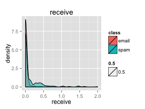
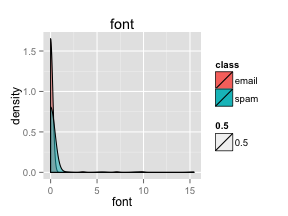
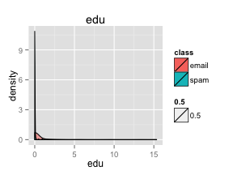
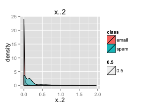
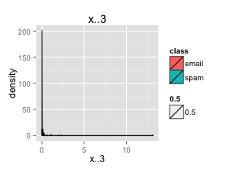

Prompt
======
This individual assignment asks students to use a statistical experiment to compare alternative classification methods. Students are encouraged to install packages with data-adaptive, machine learning algorithms. Ensemble methods (committee machines) may also be employed. Various criteria, tabular, and graphical (including receiver operating characteristic curves) are used for evaluating classifiers. Try at least one traditional and one machine learning method.

1. Load Preparation
===================

```r
library(MMST)
data(spambase)
```


2. EDA
======

```r
str(spambase)
```

```
## 'data.frame':	4601 obs. of  59 variables:
##  $ make      : num  0 0.21 0.06 0 0 0 0 0 0.15 0.06 ...
##  $ address   : num  0.64 0.28 0 0 0 0 0 0 0 0.12 ...
##  $ all       : num  0.64 0.5 0.71 0 0 0 0 0 0.46 0.77 ...
##  $ xd        : num  0 0 0 0 0 0 0 0 0 0 ...
##  $ our       : num  0.32 0.14 1.23 0.63 0.63 1.85 1.92 1.88 0.61 0.19 ...
##  $ over      : num  0 0.28 0.19 0 0 0 0 0 0 0.32 ...
##  $ remove    : num  0 0.21 0.19 0.31 0.31 0 0 0 0.3 0.38 ...
##  $ internet  : num  0 0.07 0.12 0.63 0.63 1.85 0 1.88 0 0 ...
##  $ order     : num  0 0 0.64 0.31 0.31 0 0 0 0.92 0.06 ...
##  $ mail      : num  0 0.94 0.25 0.63 0.63 0 0.64 0 0.76 0 ...
##  $ receive   : num  0 0.21 0.38 0.31 0.31 0 0.96 0 0.76 0 ...
##  $ will      : num  0.64 0.79 0.45 0.31 0.31 0 1.28 0 0.92 0.64 ...
##  $ people    : num  0 0.65 0.12 0.31 0.31 0 0 0 0 0.25 ...
##  $ report    : num  0 0.21 0 0 0 0 0 0 0 0 ...
##  $ addresses : num  0 0.14 1.75 0 0 0 0 0 0 0.12 ...
##  $ free      : num  0.32 0.14 0.06 0.31 0.31 0 0.96 0 0 0 ...
##  $ business  : num  0 0.07 0.06 0 0 0 0 0 0 0 ...
##  $ email     : num  1.29 0.28 1.03 0 0 0 0.32 0 0.15 0.12 ...
##  $ you       : num  1.93 3.47 1.36 3.18 3.18 0 3.85 0 1.23 1.67 ...
##  $ credit    : num  0 0 0.32 0 0 0 0 0 3.53 0.06 ...
##  $ your      : num  0.96 1.59 0.51 0.31 0.31 0 0.64 0 2 0.71 ...
##  $ font      : num  0 0 0 0 0 0 0 0 0 0 ...
##  $ x000      : num  0 0.43 1.16 0 0 0 0 0 0 0.19 ...
##  $ money     : num  0 0.43 0.06 0 0 0 0 0 0.15 0 ...
##  $ hp        : num  0 0 0 0 0 0 0 0 0 0 ...
##  $ hpl       : num  0 0 0 0 0 0 0 0 0 0 ...
##  $ george    : num  0 0 0 0 0 0 0 0 0 0 ...
##  $ x650      : num  0 0 0 0 0 0 0 0 0 0 ...
##  $ lab       : num  0 0 0 0 0 0 0 0 0 0 ...
##  $ labs      : num  0 0 0 0 0 0 0 0 0 0 ...
##  $ telnet    : num  0 0 0 0 0 0 0 0 0 0 ...
##  $ x857      : num  0 0 0 0 0 0 0 0 0 0 ...
##  $ data      : num  0 0 0 0 0 0 0 0 0.15 0 ...
##  $ x415      : num  0 0 0 0 0 0 0 0 0 0 ...
##  $ x85       : num  0 0 0 0 0 0 0 0 0 0 ...
##  $ technology: num  0 0 0 0 0 0 0 0 0 0 ...
##  $ x1999     : num  0 0.07 0 0 0 0 0 0 0 0 ...
##  $ parts     : num  0 0 0 0 0 0 0 0 0 0 ...
##  $ pm        : num  0 0 0 0 0 0 0 0 0 0 ...
##  $ direct    : num  0 0 0.06 0 0 0 0 0 0 0 ...
##  $ cs        : num  0 0 0 0 0 0 0 0 0 0 ...
##  $ meeting   : num  0 0 0 0 0 0 0 0 0 0 ...
##  $ original  : num  0 0 0.12 0 0 0 0 0 0.3 0 ...
##  $ project   : num  0 0 0 0 0 0 0 0 0 0.06 ...
##  $ re        : num  0 0 0.06 0 0 0 0 0 0 0 ...
##  $ edu       : num  0 0 0.06 0 0 0 0 0 0 0 ...
##  $ table     : num  0 0 0 0 0 0 0 0 0 0 ...
##  $ conference: num  0 0 0 0 0 0 0 0 0 0 ...
##  $ x.        : num  0 0 0.01 0 0 0 0 0 0 0.04 ...
##  $ x..       : num  0 0.132 0.143 0.137 0.135 0.223 0.054 0.206 0.271 0.03 ...
##  $ x...1     : num  0 0 0 0 0 0 0 0 0 0 ...
##  $ x..1      : num  0.778 0.372 0.276 0.137 0.135 0 0.164 0 0.181 0.244 ...
##  $ x..2      : num  0 0.18 0.184 0 0 0 0.054 0 0.203 0.081 ...
##  $ x..3      : num  0 0.048 0.01 0 0 0 0 0 0.022 0 ...
##  $ crla      : num  3.76 5.11 9.82 3.54 3.54 ...
##  $ crll      : int  61 101 485 40 40 15 4 11 445 43 ...
##  $ crrt      : int  278 1028 2259 191 191 54 112 49 1257 749 ...
##  $ classdigit: Factor w/ 2 levels "0","1": 2 2 2 2 2 2 2 2 2 2 ...
##  $ class     : Factor w/ 2 levels "email","spam": 2 2 2 2 2 2 2 2 2 2 ...
```

```r
head(spambase)
```

```
##   make address  all xd  our over remove internet order mail receive will
## 1 0.00    0.64 0.64  0 0.32 0.00   0.00     0.00  0.00 0.00    0.00 0.64
## 2 0.21    0.28 0.50  0 0.14 0.28   0.21     0.07  0.00 0.94    0.21 0.79
## 3 0.06    0.00 0.71  0 1.23 0.19   0.19     0.12  0.64 0.25    0.38 0.45
## 4 0.00    0.00 0.00  0 0.63 0.00   0.31     0.63  0.31 0.63    0.31 0.31
## 5 0.00    0.00 0.00  0 0.63 0.00   0.31     0.63  0.31 0.63    0.31 0.31
## 6 0.00    0.00 0.00  0 1.85 0.00   0.00     1.85  0.00 0.00    0.00 0.00
##   people report addresses free business email  you credit your font x000
## 1   0.00   0.00      0.00 0.32     0.00  1.29 1.93   0.00 0.96    0 0.00
## 2   0.65   0.21      0.14 0.14     0.07  0.28 3.47   0.00 1.59    0 0.43
## 3   0.12   0.00      1.75 0.06     0.06  1.03 1.36   0.32 0.51    0 1.16
## 4   0.31   0.00      0.00 0.31     0.00  0.00 3.18   0.00 0.31    0 0.00
## 5   0.31   0.00      0.00 0.31     0.00  0.00 3.18   0.00 0.31    0 0.00
## 6   0.00   0.00      0.00 0.00     0.00  0.00 0.00   0.00 0.00    0 0.00
##   money hp hpl george x650 lab labs telnet x857 data x415 x85 technology
## 1  0.00  0   0      0    0   0    0      0    0    0    0   0          0
## 2  0.43  0   0      0    0   0    0      0    0    0    0   0          0
## 3  0.06  0   0      0    0   0    0      0    0    0    0   0          0
## 4  0.00  0   0      0    0   0    0      0    0    0    0   0          0
## 5  0.00  0   0      0    0   0    0      0    0    0    0   0          0
## 6  0.00  0   0      0    0   0    0      0    0    0    0   0          0
##   x1999 parts pm direct cs meeting original project   re  edu table
## 1  0.00     0  0   0.00  0       0     0.00       0 0.00 0.00     0
## 2  0.07     0  0   0.00  0       0     0.00       0 0.00 0.00     0
## 3  0.00     0  0   0.06  0       0     0.12       0 0.06 0.06     0
## 4  0.00     0  0   0.00  0       0     0.00       0 0.00 0.00     0
## 5  0.00     0  0   0.00  0       0     0.00       0 0.00 0.00     0
## 6  0.00     0  0   0.00  0       0     0.00       0 0.00 0.00     0
##   conference   x.   x.. x...1  x..1  x..2  x..3  crla crll crrt classdigit
## 1          0 0.00 0.000     0 0.778 0.000 0.000 3.756   61  278          1
## 2          0 0.00 0.132     0 0.372 0.180 0.048 5.114  101 1028          1
## 3          0 0.01 0.143     0 0.276 0.184 0.010 9.821  485 2259          1
## 4          0 0.00 0.137     0 0.137 0.000 0.000 3.537   40  191          1
## 5          0 0.00 0.135     0 0.135 0.000 0.000 3.537   40  191          1
## 6          0 0.00 0.223     0 0.000 0.000 0.000 3.000   15   54          1
##   class
## 1  spam
## 2  spam
## 3  spam
## 4  spam
## 5  spam
## 6  spam
```

```r
summary(spambase)
```

```
##       make          address            all              xd       
##  Min.   :0.000   Min.   : 0.000   Min.   :0.000   Min.   : 0.00  
##  1st Qu.:0.000   1st Qu.: 0.000   1st Qu.:0.000   1st Qu.: 0.00  
##  Median :0.000   Median : 0.000   Median :0.000   Median : 0.00  
##  Mean   :0.105   Mean   : 0.213   Mean   :0.281   Mean   : 0.07  
##  3rd Qu.:0.000   3rd Qu.: 0.000   3rd Qu.:0.420   3rd Qu.: 0.00  
##  Max.   :4.540   Max.   :14.280   Max.   :5.100   Max.   :42.81  
##       our              over           remove         internet     
##  Min.   : 0.000   Min.   :0.000   Min.   :0.000   Min.   : 0.000  
##  1st Qu.: 0.000   1st Qu.:0.000   1st Qu.:0.000   1st Qu.: 0.000  
##  Median : 0.000   Median :0.000   Median :0.000   Median : 0.000  
##  Mean   : 0.312   Mean   :0.096   Mean   :0.114   Mean   : 0.105  
##  3rd Qu.: 0.380   3rd Qu.:0.000   3rd Qu.:0.000   3rd Qu.: 0.000  
##  Max.   :10.000   Max.   :5.880   Max.   :7.270   Max.   :11.110  
##      order           mail           receive            will      
##  Min.   :0.00   Min.   : 0.000   Min.   :0.0000   Min.   :0.000  
##  1st Qu.:0.00   1st Qu.: 0.000   1st Qu.:0.0000   1st Qu.:0.000  
##  Median :0.00   Median : 0.000   Median :0.0000   Median :0.100  
##  Mean   :0.09   Mean   : 0.239   Mean   :0.0598   Mean   :0.542  
##  3rd Qu.:0.00   3rd Qu.: 0.160   3rd Qu.:0.0000   3rd Qu.:0.800  
##  Max.   :5.26   Max.   :18.180   Max.   :2.6100   Max.   :9.670  
##      people          report         addresses          free       
##  Min.   :0.000   Min.   : 0.000   Min.   :0.000   Min.   : 0.000  
##  1st Qu.:0.000   1st Qu.: 0.000   1st Qu.:0.000   1st Qu.: 0.000  
##  Median :0.000   Median : 0.000   Median :0.000   Median : 0.000  
##  Mean   :0.094   Mean   : 0.059   Mean   :0.049   Mean   : 0.249  
##  3rd Qu.:0.000   3rd Qu.: 0.000   3rd Qu.:0.000   3rd Qu.: 0.100  
##  Max.   :5.550   Max.   :10.000   Max.   :4.410   Max.   :20.000  
##     business         email            you            credit      
##  Min.   :0.000   Min.   :0.000   Min.   : 0.00   Min.   : 0.000  
##  1st Qu.:0.000   1st Qu.:0.000   1st Qu.: 0.00   1st Qu.: 0.000  
##  Median :0.000   Median :0.000   Median : 1.31   Median : 0.000  
##  Mean   :0.143   Mean   :0.185   Mean   : 1.66   Mean   : 0.086  
##  3rd Qu.:0.000   3rd Qu.:0.000   3rd Qu.: 2.64   3rd Qu.: 0.000  
##  Max.   :7.140   Max.   :9.090   Max.   :18.75   Max.   :18.180  
##       your            font             x000           money       
##  Min.   : 0.00   Min.   : 0.000   Min.   :0.000   Min.   : 0.000  
##  1st Qu.: 0.00   1st Qu.: 0.000   1st Qu.:0.000   1st Qu.: 0.000  
##  Median : 0.22   Median : 0.000   Median :0.000   Median : 0.000  
##  Mean   : 0.81   Mean   : 0.121   Mean   :0.102   Mean   : 0.094  
##  3rd Qu.: 1.27   3rd Qu.: 0.000   3rd Qu.:0.000   3rd Qu.: 0.000  
##  Max.   :11.11   Max.   :17.100   Max.   :5.450   Max.   :12.500  
##        hp             hpl             george           x650      
##  Min.   : 0.00   Min.   : 0.000   Min.   : 0.00   Min.   :0.000  
##  1st Qu.: 0.00   1st Qu.: 0.000   1st Qu.: 0.00   1st Qu.:0.000  
##  Median : 0.00   Median : 0.000   Median : 0.00   Median :0.000  
##  Mean   : 0.55   Mean   : 0.265   Mean   : 0.77   Mean   :0.125  
##  3rd Qu.: 0.00   3rd Qu.: 0.000   3rd Qu.: 0.00   3rd Qu.:0.000  
##  Max.   :20.83   Max.   :16.660   Max.   :33.33   Max.   :9.090  
##       lab              labs           telnet            x857      
##  Min.   : 0.000   Min.   :0.000   Min.   : 0.000   Min.   :0.000  
##  1st Qu.: 0.000   1st Qu.:0.000   1st Qu.: 0.000   1st Qu.:0.000  
##  Median : 0.000   Median :0.000   Median : 0.000   Median :0.000  
##  Mean   : 0.099   Mean   :0.103   Mean   : 0.065   Mean   :0.047  
##  3rd Qu.: 0.000   3rd Qu.:0.000   3rd Qu.: 0.000   3rd Qu.:0.000  
##  Max.   :14.280   Max.   :5.880   Max.   :12.500   Max.   :4.760  
##       data             x415            x85           technology   
##  Min.   : 0.000   Min.   :0.000   Min.   : 0.000   Min.   :0.000  
##  1st Qu.: 0.000   1st Qu.:0.000   1st Qu.: 0.000   1st Qu.:0.000  
##  Median : 0.000   Median :0.000   Median : 0.000   Median :0.000  
##  Mean   : 0.097   Mean   :0.048   Mean   : 0.105   Mean   :0.097  
##  3rd Qu.: 0.000   3rd Qu.:0.000   3rd Qu.: 0.000   3rd Qu.:0.000  
##  Max.   :18.180   Max.   :4.760   Max.   :20.000   Max.   :7.690  
##      x1999           parts             pm             direct     
##  Min.   :0.000   Min.   :0.000   Min.   : 0.000   Min.   :0.000  
##  1st Qu.:0.000   1st Qu.:0.000   1st Qu.: 0.000   1st Qu.:0.000  
##  Median :0.000   Median :0.000   Median : 0.000   Median :0.000  
##  Mean   :0.137   Mean   :0.013   Mean   : 0.079   Mean   :0.065  
##  3rd Qu.:0.000   3rd Qu.:0.000   3rd Qu.: 0.000   3rd Qu.:0.000  
##  Max.   :6.890   Max.   :8.330   Max.   :11.110   Max.   :4.760  
##        cs           meeting          original        project      
##  Min.   :0.000   Min.   : 0.000   Min.   :0.000   Min.   : 0.000  
##  1st Qu.:0.000   1st Qu.: 0.000   1st Qu.:0.000   1st Qu.: 0.000  
##  Median :0.000   Median : 0.000   Median :0.000   Median : 0.000  
##  Mean   :0.044   Mean   : 0.132   Mean   :0.046   Mean   : 0.079  
##  3rd Qu.:0.000   3rd Qu.: 0.000   3rd Qu.:0.000   3rd Qu.: 0.000  
##  Max.   :7.140   Max.   :14.280   Max.   :3.570   Max.   :20.000  
##        re              edu            table          conference    
##  Min.   : 0.000   Min.   : 0.00   Min.   :0.0000   Min.   : 0.000  
##  1st Qu.: 0.000   1st Qu.: 0.00   1st Qu.:0.0000   1st Qu.: 0.000  
##  Median : 0.000   Median : 0.00   Median :0.0000   Median : 0.000  
##  Mean   : 0.301   Mean   : 0.18   Mean   :0.0054   Mean   : 0.032  
##  3rd Qu.: 0.110   3rd Qu.: 0.00   3rd Qu.:0.0000   3rd Qu.: 0.000  
##  Max.   :21.420   Max.   :22.05   Max.   :2.1700   Max.   :10.000  
##        x.             x..            x...1            x..1      
##  Min.   :0.000   Min.   :0.000   Min.   :0.000   Min.   : 0.00  
##  1st Qu.:0.000   1st Qu.:0.000   1st Qu.:0.000   1st Qu.: 0.00  
##  Median :0.000   Median :0.065   Median :0.000   Median : 0.00  
##  Mean   :0.039   Mean   :0.139   Mean   :0.017   Mean   : 0.27  
##  3rd Qu.:0.000   3rd Qu.:0.188   3rd Qu.:0.000   3rd Qu.: 0.32  
##  Max.   :4.385   Max.   :9.752   Max.   :4.081   Max.   :32.48  
##       x..2            x..3             crla             crll     
##  Min.   :0.000   Min.   : 0.000   Min.   :   1.0   Min.   :   1  
##  1st Qu.:0.000   1st Qu.: 0.000   1st Qu.:   1.6   1st Qu.:   6  
##  Median :0.000   Median : 0.000   Median :   2.3   Median :  15  
##  Mean   :0.076   Mean   : 0.044   Mean   :   5.2   Mean   :  52  
##  3rd Qu.:0.052   3rd Qu.: 0.000   3rd Qu.:   3.7   3rd Qu.:  43  
##  Max.   :6.003   Max.   :19.829   Max.   :1102.5   Max.   :9989  
##       crrt       classdigit   class     
##  Min.   :    1   0:2788     email:2788  
##  1st Qu.:   35   1:1813     spam :1813  
##  Median :   95                          
##  Mean   :  283                          
##  3rd Qu.:  266                          
##  Max.   :15841
```


## 2.1 Between Explanatory Vars
Let's look at the relationships using a correlogram. Due to the large sample size, it might be best to take a smaller sample first to not kill the machine.

```r
require(corrgram)
```

```
## Loading required package: corrgram
## Loading required package: seriation
```

```r
mask <- sample(c(T, F), nrow(spambase), replace = T, prob = c(0.1, 0.9))
temp <- spambase[mask, ]
corrgram(temp, upper.panel = panel.conf, lower.panel = panel.pie)
```

 

There seems to be heavy multicollinearity between x857 through technology (minus data). Especially concerning is the relationship between "x857" and "x415". Let's run a correlogram on this smaller slice using the full dataset.

```r
corrgram(spambase[, 25:40], upper.panel = panel.conf, lower.panel = panel.pie)
```

 

We see that "x857" and "x415" are indeed 1:1 correlated with one another. It doesn't makes sense to keep this redundancy.

***Aside: Remove detected redundancy***

```r
spambase <- spambase[, -34]
```


Still, there remains some strong correlations within multiple variables. Let's keep this in mind while we continue exploring the data.

## Vs Target

```r
require(ggplot2)
```

```
## Loading required package: ggplot2
```

```r
for (i in 1:nrow(temp)) {
    p <- ggplot(temp, aes(x = temp[, i], fill = class, alpha = 0.5)) + geom_density() + 
        labs(title = names(temp)[i], x = names(temp)[i])
    print(p)
}
```

                                                           

```
## Error: undefined columns selected
```

There seems to be some variables that have different densities between the classes. These variables may be useful when put into the classification models.


3. Modeling Iter. 1
===================
3.1 Split Test/Train
--------------------

```r
mask <- sample(c(T, F), nrow(spambase), replace = T, prob = c(0.8, 0.2))
train <- spambase[mask, ]
test <- spambase[!mask, ]
```

Are there enough test cases in the test set?

```r
table(test$class)
```

```
## 
## email  spam 
##   554   376
```

There are.

3.2 Logistic Regression
-----------------------
### 3.2.1 Fit the model

```r
fit <- glm(class ~ ., family = binomial, train[-57])
```

```
## Warning: glm.fit: fitted probabilities numerically 0 or 1 occurred
```

```r
summary(fit)
```

```
## 
## Call:
## glm(formula = class ~ ., family = binomial, data = train[-57])
## 
## Deviance Residuals: 
##    Min      1Q  Median      3Q     Max  
## -4.563  -0.200   0.000   0.091   4.761  
## 
## Coefficients:
##              Estimate Std. Error z value Pr(>|z|)    
## (Intercept) -1.57e+00   1.57e-01  -10.00  < 2e-16 ***
## make        -3.03e-01   2.57e-01   -1.18  0.23813    
## address     -1.41e-01   7.98e-02   -1.76  0.07844 .  
## all          3.68e-02   1.22e-01    0.30  0.76269    
## xd           3.15e+00   1.76e+00    1.79  0.07315 .  
## our          5.58e-01   1.17e-01    4.75  2.0e-06 ***
## over         8.33e-01   2.99e-01    2.78  0.00536 ** 
## remove       2.43e+00   3.78e-01    6.44  1.2e-10 ***
## internet     4.56e-01   1.47e-01    3.10  0.00197 ** 
## order        1.10e+00   3.49e-01    3.16  0.00158 ** 
## mail         2.64e-01   1.04e-01    2.54  0.01118 *  
## receive     -3.48e-01   3.34e-01   -1.04  0.29788    
## will        -1.99e-01   8.72e-02   -2.28  0.02260 *  
## people      -7.50e-02   2.58e-01   -0.29  0.77151    
## report       6.94e-02   1.48e-01    0.47  0.63908    
## addresses    8.92e-01   7.80e-01    1.14  0.25263    
## free         9.35e-01   1.60e-01    5.86  4.6e-09 ***
## business     1.23e+00   2.79e-01    4.41  1.0e-05 ***
## email        3.02e-02   1.34e-01    0.23  0.82192    
## you          1.04e-01   3.92e-02    2.65  0.00802 ** 
## credit       7.73e-01   5.11e-01    1.51  0.12984    
## your         2.38e-01   5.77e-02    4.13  3.7e-05 ***
## font         2.64e-01   1.95e-01    1.36  0.17448    
## x000         2.85e+00   6.76e-01    4.22  2.5e-05 ***
## money        2.46e-01   1.39e-01    1.76  0.07809 .  
## hp          -1.68e+00   3.21e-01   -5.25  1.5e-07 ***
## hpl         -1.24e+00   4.95e-01   -2.51  0.01203 *  
## george      -9.70e+00   2.12e+00   -4.57  5.0e-06 ***
## x650         4.99e-01   2.62e-01    1.91  0.05627 .  
## lab         -2.23e+00   1.52e+00   -1.47  0.14266    
## labs        -3.81e-01   3.34e-01   -1.14  0.25359    
## telnet      -1.89e-01   5.45e-01   -0.35  0.72871    
## x857         3.20e+00   2.98e+00    1.07  0.28315    
## data        -8.94e-01   4.00e-01   -2.24  0.02537 *  
## x85         -2.17e+00   1.07e+00   -2.04  0.04180 *  
## technology   6.83e-01   3.42e-01    2.00  0.04590 *  
## x1999       -2.53e-01   2.66e-01   -0.95  0.34106    
## parts       -6.59e-01   5.95e-01   -1.11  0.26777    
## pm          -8.22e-01   4.24e-01   -1.94  0.05283 .  
## direct      -4.53e-01   4.00e-01   -1.13  0.25727    
## cs          -3.90e+01   4.59e+01   -0.85  0.39610    
## meeting     -2.79e+00   1.06e+00   -2.63  0.00853 ** 
## original    -1.25e+00   9.14e-01   -1.36  0.17283    
## project     -1.43e+00   5.45e-01   -2.63  0.00864 ** 
## re          -9.56e-01   1.83e-01   -5.23  1.7e-07 ***
## edu         -1.15e+00   2.58e-01   -4.47  7.9e-06 ***
## table       -3.83e+00   2.59e+00   -1.48  0.13955    
## conference  -3.44e+00   1.55e+00   -2.21  0.02703 *  
## x.          -1.34e+00   5.65e-01   -2.37  0.01764 *  
## x..          9.30e-02   3.13e-01    0.30  0.76622    
## x...1       -1.25e+00   1.60e+00   -0.78  0.43611    
## x..1         2.81e-01   6.76e-02    4.16  3.2e-05 ***
## x..2         7.87e+00   9.77e-01    8.05  8.1e-16 ***
## x..3         2.53e+00   1.24e+00    2.04  0.04118 *  
## crla        -6.85e-03   1.88e-02   -0.36  0.71633    
## crll         1.06e-02   2.81e-03    3.77  0.00016 ***
## crrt         6.67e-04   2.46e-04    2.71  0.00681 ** 
## ---
## Signif. codes:  0 '***' 0.001 '**' 0.01 '*' 0.05 '.' 0.1 ' ' 1
## 
## (Dispersion parameter for binomial family taken to be 1)
## 
##     Null deviance: 4914.7  on 3670  degrees of freedom
## Residual deviance: 1412.4  on 3614  degrees of freedom
## AIC: 1526
## 
## Number of Fisher Scoring iterations: 14
```

### 3.2.2 Test the model

```r
fit.pred <- predict(fit, test, type = "response")
```

#### 3.2.2.1 Confusion table using 0.5 cutoff rate

```r
y_hat <- 1 * (fit.pred > 0.5)
t <- table(test$classdigit, y_hat)
addmargins(t)
```

```
##      y_hat
##         0   1 Sum
##   0   520  34 554
##   1    43 333 376
##   Sum 563 367 930
```

It's not too bad. False positive is 22/925 and false negative is 39/925. This is only at 0.5 cutoff though. Let's use an ROC Curve instead.
#### 3.2.2.2 Using ROC Curve

```r
require(ROCR)
```

```
## Loading required package: ROCR
## Loading required package: gplots
## KernSmooth 2.23 loaded
## Copyright M. P. Wand 1997-2009
## 
## Attaching package: 'gplots'
## 
## The following object is masked from 'package:stats':
## 
##     lowess
```

```r
pred <- prediction(fit.pred, test$classdigit)
perf <- performance(pred, "tpr", "fpr")
plot(perf)
```

 

```r
auc.tmp <- performance(pred, "auc")
print(fit.auc <- as.numeric(auc.tmp@y.values))
```

```
## [1] 0.9715
```

The AUC is very solid @ 0.9696

3.3 Decision Tree
-----------------
### 3.3.1 Fit the model

```r
require(rpart)
```

```
## Loading required package: rpart
```

```r
tree <- rpart(class ~ ., train[-57])
tree
```

```
## n= 3671 
## 
## node), split, n, loss, yval, (yprob)
##       * denotes terminal node
## 
##  1) root 3671 1437 email (0.60855 0.39145)  
##    2) x..2< 0.0445 2731  618 email (0.77371 0.22629)  
##      4) remove< 0.055 2483  391 email (0.84253 0.15747)  
##        8) x..1< 0.4765 2229  226 email (0.89861 0.10139)  
##         16) x000< 0.3 2200  202 email (0.90818 0.09182) *
##         17) x000>=0.3 29    5 spam (0.17241 0.82759) *
##        9) x..1>=0.4765 254   89 spam (0.35039 0.64961)  
##         18) crll< 10.5 97   29 email (0.70103 0.29897) *
##         19) crll>=10.5 157   21 spam (0.13376 0.86624) *
##      5) remove>=0.055 248   21 spam (0.08468 0.91532) *
##    3) x..2>=0.0445 940  121 spam (0.12872 0.87128)  
##      6) hp>=0.385 70    8 email (0.88571 0.11429) *
##      7) hp< 0.385 870   59 spam (0.06782 0.93218) *
```

```r
plot(tree)
```

 

### 3.3.2 Test the model

```r
tree.pred <- predict(tree, test)
```

#### 3.3.2.1 Confusion table

```r
y_hat <- predict(tree, test, type = "class")
t <- table(test$class, y_hat)
addmargins(t)
```

```
##        y_hat
##         email spam Sum
##   email   520   34 554
##   spam     67  309 376
##   Sum     587  343 930
```

The decision tree performs well, but not as well as the logistic regression. It has 45 FP and 48 FN.
#### 3.4.2.2 Using ROC Curve

```r
require(ROCR)
pred <- prediction(as.matrix(tree.pred)[, 2], test$classdigit)
perf <- performance(pred, "tpr", "fpr")
plot(perf)
```

 

```r
auc.tmp <- performance(pred, "auc")
print(fit.auc <- as.numeric(auc.tmp@y.values))
```

```
## [1] 0.8862
```

The AUC is decently good @ 0.9073

3.4 Random Forest (default)
-----------------
### 3.4.1 Fit the model

```r
require(randomForest)
```

```
## Loading required package: randomForest
## randomForest 4.6-7
## Type rfNews() to see new features/changes/bug fixes.
```

```r
rf <- randomForest(class ~ ., train[-57])
rf
```

```
## 
## Call:
##  randomForest(formula = class ~ ., data = train[-57]) 
##                Type of random forest: classification
##                      Number of trees: 500
## No. of variables tried at each split: 7
## 
##         OOB estimate of  error rate: 4.85%
## Confusion matrix:
##       email spam class.error
## email  2167   67     0.02999
## spam    111 1326     0.07724
```

### 3.4.2 Test the model
#### 3.4.2.1 Confusion table

```r
y_hat <- predict(rf, test)
t <- table(test$class, y_hat)
addmargins(t)
```

```
##        y_hat
##         email spam Sum
##   email   534   20 554
##   spam     24  352 376
##   Sum     558  372 930
```

The random forest performs better than the others, with a FP or 10 and FN of 28.
#### 3.3.2.2 Using ROC Curve

```r
require(ROCR)
rf.pred <- predict(rf, test, type = "prob")
pred <- prediction(as.matrix(rf.pred)[, 2], test$classdigit)
perf <- performance(pred, "tpr", "fpr")
plot(perf)
```

 

```r
auc.tmp <- performance(pred, "auc")
print(fit.auc <- as.numeric(auc.tmp@y.values))
```

```
## [1] 0.9851
```

The ROC for the random forest is great with its AUC of 0.9904!

3.5 Random Forest (tweaked)
-----------------
### 3.5.1 Fit the model

```r
require(randomForest)
rf <- randomForest(class ~ ., train[-57], mtry = 15)
rf
```

```
## 
## Call:
##  randomForest(formula = class ~ ., data = train[-57], mtry = 15) 
##                Type of random forest: classification
##                      Number of trees: 500
## No. of variables tried at each split: 15
## 
##         OOB estimate of  error rate: 4.82%
## Confusion matrix:
##       email spam class.error
## email  2168   66     0.02954
## spam    111 1326     0.07724
```

### 3.5.2 Test the model
#### 3.5.2.1 Confusion table

```r
y_hat <- predict(rf, test)
t <- table(test$class, y_hat)
addmargins(t)
```

```
##        y_hat
##         email spam Sum
##   email   531   23 554
##   spam     22  354 376
##   Sum     553  377 930
```

#### 3.5.2.2 Using ROC Curve

```r
require(ROCR)
rf.pred <- predict(rf, test, type = "prob")
pred <- prediction(as.matrix(rf.pred)[, 2], test$classdigit)
perf <- performance(pred, "tpr", "fpr")
plot(perf)
```

 

```r
auc.tmp <- performance(pred, "auc")
print(fit.auc <- as.numeric(auc.tmp@y.values))
```

```
## [1] 0.9843
```

The tweaked random forest works about as well as the default. There's probably no point to modifying the default parameters.


4. Modeling Iter. 2
===================
This time we'll first apply a PCA to the dataset.
4.1 PCA
-------
### 4.1.1 Build PC mappings

```r
pc <- princomp(spambase[, -57:-58])
summary(pc)
```

```
## Importance of components:
##                         Comp.1    Comp.2    Comp.3    Comp.4    Comp.5
## Standard deviation     613.941 169.95779 27.379691 3.377e+00 2.030e+00
## Proportion of Variance   0.927   0.07104  0.001844 2.806e-05 1.013e-05
## Cumulative Proportion    0.927   0.99807  0.999914 9.999e-01 1.000e+00
##                           Comp.6    Comp.7    Comp.8    Comp.9   Comp.10
## Standard deviation     1.617e+00 1.395e+00 1.279e+00 1.155e+00 1.031e+00
## Proportion of Variance 6.427e-06 4.786e-06 4.025e-06 3.281e-06 2.617e-06
## Cumulative Proportion  1.000e+00 1.000e+00 1.000e+00 1.000e+00 1.000e+00
##                          Comp.11   Comp.12   Comp.13   Comp.14   Comp.15
## Standard deviation     1.000e+00 9.253e-01 8.983e-01 8.602e-01 8.242e-01
## Proportion of Variance 2.461e-06 2.106e-06 1.985e-06 1.820e-06 1.671e-06
## Cumulative Proportion  1.000e+00 1.000e+00 1.000e+00 1.000e+00 1.000e+00
##                          Comp.16   Comp.17   Comp.18   Comp.19   Comp.20
## Standard deviation     7.826e-01 7.531e-01 6.833e-01 6.493e-01 6.339e-01
## Proportion of Variance 1.506e-06 1.395e-06 1.148e-06 1.037e-06 9.883e-07
## Cumulative Proportion  1.000e+00 1.000e+00 1.000e+00 1.000e+00 1.000e+00
##                          Comp.21   Comp.22   Comp.23   Comp.24   Comp.25
## Standard deviation     6.140e-01 5.534e-01 5.369e-01 5.184e-01 4.761e-01
## Proportion of Variance 9.273e-07 7.533e-07 7.089e-07 6.610e-07 5.576e-07
## Cumulative Proportion  1.000e+00 1.000e+00 1.000e+00 1.000e+00 1.000e+00
##                          Comp.26   Comp.27   Comp.28   Comp.29   Comp.30
## Standard deviation     4.684e-01 4.382e-01 4.319e-01 4.226e-01 4.178e-01
## Proportion of Variance 5.396e-07 4.722e-07 4.589e-07 4.393e-07 4.293e-07
## Cumulative Proportion  1.000e+00 1.000e+00 1.000e+00 1.000e+00 1.000e+00
##                          Comp.31   Comp.32   Comp.33   Comp.34   Comp.35
## Standard deviation     3.815e-01 3.721e-01 3.634e-01 3.540e-01 3.497e-01
## Proportion of Variance 3.580e-07 3.405e-07 3.248e-07 3.083e-07 3.007e-07
## Cumulative Proportion  1.000e+00 1.000e+00 1.000e+00 1.000e+00 1.000e+00
##                          Comp.36   Comp.37   Comp.38   Comp.39   Comp.40
## Standard deviation     3.413e-01 3.330e-01 3.286e-01 2.919e-01 2.867e-01
## Proportion of Variance 2.865e-07 2.728e-07 2.655e-07 2.096e-07 2.021e-07
## Cumulative Proportion  1.000e+00 1.000e+00 1.000e+00 1.000e+00 1.000e+00
##                          Comp.41   Comp.42   Comp.43   Comp.44   Comp.45
## Standard deviation     2.840e-01 2.759e-01 2.653e-01 2.539e-01 2.316e-01
## Proportion of Variance 1.984e-07 1.873e-07 1.731e-07 1.586e-07 1.319e-07
## Cumulative Proportion  1.000e+00 1.000e+00 1.000e+00 1.000e+00 1.000e+00
##                          Comp.46   Comp.47   Comp.48   Comp.49   Comp.50
## Standard deviation     2.251e-01 2.210e-01 2.136e-01 2.126e-01 2.060e-01
## Proportion of Variance 1.247e-07 1.201e-07 1.123e-07 1.112e-07 1.044e-07
## Cumulative Proportion  1.000e+00 1.000e+00 1.000e+00 1.000e+00 1.000e+00
##                          Comp.51   Comp.52   Comp.53   Comp.54   Comp.55
## Standard deviation     1.949e-01 1.931e-01 1.809e-01 1.234e-01 1.069e-01
## Proportion of Variance 9.343e-08 9.172e-08 8.050e-08 3.748e-08 2.812e-08
## Cumulative Proportion  1.000e+00 1.000e+00 1.000e+00 1.000e+00 1.000e+00
##                          Comp.56
## Standard deviation     7.577e-02
## Proportion of Variance 1.412e-08
## Cumulative Proportion  1.000e+00
```

```r
plot(pc)
```

 

Just 3 PCs capture as much as 99.99% of the variance. Let's just take these three columns to speed up the modeling process.
#### 4.1.2 Build train and test sets

```r
train.pc <- as.data.frame(predict(pc, train))
train.pc <- train.pc[, 1:3]
train.pc <- cbind(train.pc, train$class)
names(train.pc)[4] <- "class"
test.pc <- as.data.frame(predict(pc, test))
test.pc <- test.pc[, 1:3]
test.pc <- cbind(test.pc, test$class)
names(test.pc)[4] <- "class"
```


4.2 Logistic Regression
-----------------------
### 4.2.1 Fit the model

```r
fit <- glm(class ~ ., family = binomial, train.pc)
```

```
## Warning: glm.fit: fitted probabilities numerically 0 or 1 occurred
```

```r
summary(fit)
```

```
## 
## Call:
## glm(formula = class ~ ., family = binomial, data = train.pc)
## 
## Deviance Residuals: 
##    Min      1Q  Median      3Q     Max  
## -8.490  -0.805  -0.720   1.068   1.749  
## 
## Coefficients:
##              Estimate Std. Error z value Pr(>|z|)    
## (Intercept)  0.123125   0.059864    2.06   0.0397 *  
## Comp.1       0.004245   0.000226   18.80   <2e-16 ***
## Comp.2      -0.027440   0.001841  -14.91   <2e-16 ***
## Comp.3      -0.062111   0.023643   -2.63   0.0086 ** 
## ---
## Signif. codes:  0 '***' 0.001 '**' 0.01 '*' 0.05 '.' 0.1 ' ' 1
## 
## (Dispersion parameter for binomial family taken to be 1)
## 
##     Null deviance: 4914.7  on 3670  degrees of freedom
## Residual deviance: 4090.7  on 3667  degrees of freedom
## AIC: 4099
## 
## Number of Fisher Scoring iterations: 8
```

### 4.2.2 Test the model

```r
fit.pred <- predict(fit, test.pc, type = "response")
```

#### 4.2.2.1 Confusion table using 0.5 cutoff rate

```r
y_hat <- 1 * (fit.pred > 0.5)
t <- table(test.pc$class, y_hat)
addmargins(t)
```

```
##        y_hat
##           0   1 Sum
##   email 503  51 554
##   spam  209 167 376
##   Sum   712 218 930
```

The performance of the logistic regression decreased drasitically after a PCA. It's FP is now 31 and its FN is now a staggering 193... Perhaps the ROC will have more information.
#### 4.2.2.2 Using ROC Curve

```r
require(ROCR)
pred <- prediction(fit.pred, test.pc$class)
perf <- performance(pred, "tpr", "fpr")
plot(perf)
```

 

```r
auc.tmp <- performance(pred, "auc")
print(fit.auc <- as.numeric(auc.tmp@y.values))
```

```
## [1] 0.8035
```

The AUC is now 0.8417 compared to 0.9696 from before. Given that a PCA should be more accurate, I'm starting to be concerned that the logistic may actually be overfitting. Let's see the other algorithms to see what happens.

4.3 Decision Tree
-----------------
### 4.3.1 Fit the model

```r
require(rpart)
tree <- rpart(class ~ ., train.pc)
tree
```

```
## n= 3671 
## 
## node), split, n, loss, yval, (yprob)
##       * denotes terminal node
## 
##  1) root 3671 1437 email (0.6086 0.3914)  
##    2) Comp.1< -213.4 1559  254 email (0.8371 0.1629) *
##    3) Comp.1>=-213.4 2112  929 spam (0.4399 0.5601)  
##      6) Comp.2>=3.787 1272  578 email (0.5456 0.4544)  
##       12) Comp.1< 650.8 1089  449 email (0.5877 0.4123)  
##         24) Comp.3< 1.229 995  384 email (0.6141 0.3859) *
##         25) Comp.3>=1.229 94   29 spam (0.3085 0.6915) *
##       13) Comp.1>=650.8 183   54 spam (0.2951 0.7049) *
##      7) Comp.2< 3.787 840  235 spam (0.2798 0.7202) *
```

```r
plot(tree)
```

 

### 4.3.2 Test the model

```r
tree.pred <- predict(tree, test.pc)
```

#### 4.3.2.1 Confusion table

```r
y_hat <- predict(tree, test.pc, type = "class")
t <- table(test.pc$class, y_hat)
addmargins(t)
```

```
##        y_hat
##         email spam Sum
##   email   463   91 554
##   spam    179  197 376
##   Sum     642  288 930
```

The decision tree has also decreased in accuracy. We see the same same increase in FN (48 -> 127) as we did in logistic regression. Perhaps PCA wasn't the best idea after all, as it seems to be losing information.
#### 4.3.2.2 Using ROC Curve

```r
require(ROCR)
pred <- prediction(as.matrix(tree.pred)[, 2], test.pc$class)
perf <- performance(pred, "tpr", "fpr")
plot(perf)
```

 

```r
auc.tmp <- performance(pred, "auc")
print(fit.auc <- as.numeric(auc.tmp@y.values))
```

```
## [1] 0.7415
```

AUC has also decreased to 0.82 compared to the previous 0.9073.

4.4 Random Forest
-----------------
### 4.4.1 Fit the model

```r
require(randomForest)
rf <- randomForest(class ~ ., train.pc)
rf
```

```
## 
## Call:
##  randomForest(formula = class ~ ., data = train.pc) 
##                Type of random forest: classification
##                      Number of trees: 500
## No. of variables tried at each split: 1
## 
##         OOB estimate of  error rate: 18.82%
## Confusion matrix:
##       email spam class.error
## email  1930  304      0.1361
## spam    387 1050      0.2693
```

### 4.4.2 Test the model
#### 4.4.2.1 Confusion table

```r
y_hat <- predict(rf, test.pc)
t <- table(test.pc$class, y_hat)
addmargins(t)
```

```
##        y_hat
##         email spam Sum
##   email   472   82 554
##   spam     92  284 376
##   Sum     564  366 930
```

Even the RF is decreasing in accuracy, from a FP or 10 and FN of 28 to 67 and 83.
#### 4.4.2.2 Using ROC Curve

```r
require(ROCR)
rf.pred <- predict(rf, test.pc, type = "prob")
pred <- prediction(as.matrix(rf.pred)[, 2], test.pc$class)
perf <- performance(pred, "tpr", "fpr")
plot(perf)
```

 

```r
auc.tmp <- performance(pred, "auc")
print(fit.auc <- as.numeric(auc.tmp@y.values))
```

```
## [1] 0.8841
```

The ROC for the random forest has decreased to 0.888 from 0.9904.


5. Modeling Iter. 3
===================
The model building was horrible when only 3 CPs were included. Seems a lot of information was lost. When we dig into the linear equations, this information loss makes sense. The top 3 PCs are constructed only using the 'crla', 'crll', and 'crtt' attributes. This means that if we use the top 3 CPs, the information provided by the other variables are completely ignored. We also see that in terms of magnitude, these three variables are in the thousands whereas the other variabes are in the ones and tens. This can explain the large amount of variance provided by these 3 variables.

Let's include a few more PCs to try to bring in some of the information.

5.1 PCA
-------
### 5.1.1 Build PC mappings

```r
pc <- princomp(spambase[, -57:-58])
summary(pc)
```

```
## Importance of components:
##                         Comp.1    Comp.2    Comp.3    Comp.4    Comp.5
## Standard deviation     613.941 169.95779 27.379691 3.377e+00 2.030e+00
## Proportion of Variance   0.927   0.07104  0.001844 2.806e-05 1.013e-05
## Cumulative Proportion    0.927   0.99807  0.999914 9.999e-01 1.000e+00
##                           Comp.6    Comp.7    Comp.8    Comp.9   Comp.10
## Standard deviation     1.617e+00 1.395e+00 1.279e+00 1.155e+00 1.031e+00
## Proportion of Variance 6.427e-06 4.786e-06 4.025e-06 3.281e-06 2.617e-06
## Cumulative Proportion  1.000e+00 1.000e+00 1.000e+00 1.000e+00 1.000e+00
##                          Comp.11   Comp.12   Comp.13   Comp.14   Comp.15
## Standard deviation     1.000e+00 9.253e-01 8.983e-01 8.602e-01 8.242e-01
## Proportion of Variance 2.461e-06 2.106e-06 1.985e-06 1.820e-06 1.671e-06
## Cumulative Proportion  1.000e+00 1.000e+00 1.000e+00 1.000e+00 1.000e+00
##                          Comp.16   Comp.17   Comp.18   Comp.19   Comp.20
## Standard deviation     7.826e-01 7.531e-01 6.833e-01 6.493e-01 6.339e-01
## Proportion of Variance 1.506e-06 1.395e-06 1.148e-06 1.037e-06 9.883e-07
## Cumulative Proportion  1.000e+00 1.000e+00 1.000e+00 1.000e+00 1.000e+00
##                          Comp.21   Comp.22   Comp.23   Comp.24   Comp.25
## Standard deviation     6.140e-01 5.534e-01 5.369e-01 5.184e-01 4.761e-01
## Proportion of Variance 9.273e-07 7.533e-07 7.089e-07 6.610e-07 5.576e-07
## Cumulative Proportion  1.000e+00 1.000e+00 1.000e+00 1.000e+00 1.000e+00
##                          Comp.26   Comp.27   Comp.28   Comp.29   Comp.30
## Standard deviation     4.684e-01 4.382e-01 4.319e-01 4.226e-01 4.178e-01
## Proportion of Variance 5.396e-07 4.722e-07 4.589e-07 4.393e-07 4.293e-07
## Cumulative Proportion  1.000e+00 1.000e+00 1.000e+00 1.000e+00 1.000e+00
##                          Comp.31   Comp.32   Comp.33   Comp.34   Comp.35
## Standard deviation     3.815e-01 3.721e-01 3.634e-01 3.540e-01 3.497e-01
## Proportion of Variance 3.580e-07 3.405e-07 3.248e-07 3.083e-07 3.007e-07
## Cumulative Proportion  1.000e+00 1.000e+00 1.000e+00 1.000e+00 1.000e+00
##                          Comp.36   Comp.37   Comp.38   Comp.39   Comp.40
## Standard deviation     3.413e-01 3.330e-01 3.286e-01 2.919e-01 2.867e-01
## Proportion of Variance 2.865e-07 2.728e-07 2.655e-07 2.096e-07 2.021e-07
## Cumulative Proportion  1.000e+00 1.000e+00 1.000e+00 1.000e+00 1.000e+00
##                          Comp.41   Comp.42   Comp.43   Comp.44   Comp.45
## Standard deviation     2.840e-01 2.759e-01 2.653e-01 2.539e-01 2.316e-01
## Proportion of Variance 1.984e-07 1.873e-07 1.731e-07 1.586e-07 1.319e-07
## Cumulative Proportion  1.000e+00 1.000e+00 1.000e+00 1.000e+00 1.000e+00
##                          Comp.46   Comp.47   Comp.48   Comp.49   Comp.50
## Standard deviation     2.251e-01 2.210e-01 2.136e-01 2.126e-01 2.060e-01
## Proportion of Variance 1.247e-07 1.201e-07 1.123e-07 1.112e-07 1.044e-07
## Cumulative Proportion  1.000e+00 1.000e+00 1.000e+00 1.000e+00 1.000e+00
##                          Comp.51   Comp.52   Comp.53   Comp.54   Comp.55
## Standard deviation     1.949e-01 1.931e-01 1.809e-01 1.234e-01 1.069e-01
## Proportion of Variance 9.343e-08 9.172e-08 8.050e-08 3.748e-08 2.812e-08
## Cumulative Proportion  1.000e+00 1.000e+00 1.000e+00 1.000e+00 1.000e+00
##                          Comp.56
## Standard deviation     7.577e-02
## Proportion of Variance 1.412e-08
## Cumulative Proportion  1.000e+00
```

```r
plot(pc)
```

 


#### 5.1.2 Build train and test sets

```r
train.pc <- as.data.frame(predict(pc, train))
train.pc <- train.pc[, 1:15]
train.pc <- cbind(train.pc, train$class)
names(train.pc)[16] <- "class"
test.pc <- as.data.frame(predict(pc, test))
test.pc <- test.pc[, 1:15]
test.pc <- cbind(test.pc, test$class)
names(test.pc)[16] <- "class"
```


5.2 Logistic Regression
-----------------------
### 5.2.1 Fit the model

```r
fit <- glm(class ~ ., family = binomial, train.pc)
```

```
## Warning: glm.fit: fitted probabilities numerically 0 or 1 occurred
```

```r
summary(fit)
```

```
## 
## Call:
## glm(formula = class ~ ., family = binomial, data = train.pc)
## 
## Deviance Residuals: 
##    Min      1Q  Median      3Q     Max  
## -5.347  -0.372   0.000   0.385   5.164  
## 
## Coefficients:
##             Estimate Std. Error z value Pr(>|z|)    
## (Intercept) -9.53126    1.40527   -6.78  1.2e-11 ***
## Comp.1       0.00997    0.00113    8.81  < 2e-16 ***
## Comp.2      -0.01704    0.00183   -9.32  < 2e-16 ***
## Comp.3       0.00932    0.01921    0.49   0.6277    
## Comp.4      11.03737    1.86108    5.93  3.0e-09 ***
## Comp.5      -0.73259    0.26385   -2.78   0.0055 ** 
## Comp.6       2.49266    0.26899    9.27  < 2e-16 ***
## Comp.7       5.94275    2.04995    2.90   0.0037 ** 
## Comp.8      -0.06798    0.14349   -0.47   0.6357    
## Comp.9      -0.82913    0.12595   -6.58  4.6e-11 ***
## Comp.10      0.25121    0.11897    2.11   0.0347 *  
## Comp.11     -0.29046    0.13380   -2.17   0.0299 *  
## Comp.12      1.34647    0.25830    5.21  1.9e-07 ***
## Comp.13      2.65263    0.27277    9.72  < 2e-16 ***
## Comp.14     -0.68895    0.24405   -2.82   0.0048 ** 
## Comp.15      0.67091    0.17094    3.92  8.7e-05 ***
## ---
## Signif. codes:  0 '***' 0.001 '**' 0.01 '*' 0.05 '.' 0.1 ' ' 1
## 
## (Dispersion parameter for binomial family taken to be 1)
## 
##     Null deviance: 4914.7  on 3670  degrees of freedom
## Residual deviance: 2069.1  on 3655  degrees of freedom
## AIC: 2101
## 
## Number of Fisher Scoring iterations: 12
```

### 5.2.2 Test the model

```r
fit.pred <- predict(fit, test.pc, type = "response")
```

#### 5.2.2.1 Confusion table using 0.5 cutoff rate

```r
y_hat <- 1 * (fit.pred > 0.5)
t <- table(test.pc$class, y_hat)
addmargins(t)
```

```
##        y_hat
##           0   1 Sum
##   email 507  47 554
##   spam   45 331 376
##   Sum   552 378 930
```

Now the FP is 34 and the FN and 40. Still not as good as initially. Maybe it's overfitting or we still lost information in the PCA.
#### 5.2.2.2 Using ROC Curve

```r
require(ROCR)
pred <- prediction(fit.pred, test.pc$class)
perf <- performance(pred, "tpr", "fpr")
plot(perf)
```

 

```r
auc.tmp <- performance(pred, "auc")
print(fit.auc <- as.numeric(auc.tmp@y.values))
```

```
## [1] 0.9621
```

The AUC is now 0.9614 compared to the 0.9696 initially. This is better than the previous model with 3 PCs but still not as good as the initial raw model.

5.3 Decision Tree
-----------------
### 5.3.1 Fit the model

```r
require(rpart)
tree <- rpart(class ~ ., train.pc)
tree
```

```
## n= 3671 
## 
## node), split, n, loss, yval, (yprob)
##       * denotes terminal node
## 
##   1) root 3671 1437 email (0.60855 0.39145)  
##     2) Comp.5>=0.7094 1294  131 email (0.89876 0.10124) *
##     3) Comp.5< 0.7094 2377 1071 spam (0.45057 0.54943)  
##       6) Comp.1< -197.7 1073  281 email (0.73812 0.26188)  
##        12) Comp.13< 0.6343 967  201 email (0.79214 0.20786)  
##          24) Comp.4< 0.9906 553   47 email (0.91501 0.08499) *
##          25) Comp.4>=0.9906 414  154 email (0.62802 0.37198)  
##            50) Comp.1< -243.4 238   50 email (0.78992 0.21008) *
##            51) Comp.1>=-243.4 176   72 spam (0.40909 0.59091)  
##             102) Comp.12< -0.6062 28    2 email (0.92857 0.07143) *
##             103) Comp.12>=-0.6062 148   46 spam (0.31081 0.68919) *
##        13) Comp.13>=0.6343 106   26 spam (0.24528 0.75472) *
##       7) Comp.1>=-197.7 1304  279 spam (0.21396 0.78604)  
##        14) Comp.5>=-0.176 336  160 spam (0.47619 0.52381)  
##          28) Comp.14>=0.06062 116   26 email (0.77586 0.22414) *
##          29) Comp.14< 0.06062 220   70 spam (0.31818 0.68182)  
##            58) Comp.15>=0.3172 79   31 email (0.60759 0.39241) *
##            59) Comp.15< 0.3172 141   22 spam (0.15603 0.84397) *
##        15) Comp.5< -0.176 968  119 spam (0.12293 0.87707)  
##          30) Comp.12< -0.52 31    6 email (0.80645 0.19355) *
##          31) Comp.12>=-0.52 937   94 spam (0.10032 0.89968) *
```

```r
plot(tree)
```

 

### 5.3.2 Test the model

```r
tree.pred <- predict(tree, test.pc)
```

#### 5.3.2.1 Confusion table

```r
y_hat <- predict(tree, test.pc, type = "class")
t <- table(test.pc$class, y_hat)
addmargins(t)
```

```
##        y_hat
##         email spam Sum
##   email   500   54 554
##   spam     91  285 376
##   Sum     591  339 930
```

The FP is now 64 with the FN at 65. Still not as good as the original.
#### 5.3.2.2 Using ROC Curve

```r
require(ROCR)
pred <- prediction(as.matrix(tree.pred)[, 2], test.pc$class)
perf <- performance(pred, "tpr", "fpr")
plot(perf)
```

 

```r
auc.tmp <- performance(pred, "auc")
print(fit.auc <- as.numeric(auc.tmp@y.values))
```

```
## [1] 0.8696
```

AUC is now 0.88 compared to the initial 0.9073.

5.4 Random Forest
-----------------
### 5.4.1 Fit the model

```r
require(randomForest)
rf <- randomForest(class ~ ., train.pc)
rf
```

```
## 
## Call:
##  randomForest(formula = class ~ ., data = train.pc) 
##                Type of random forest: classification
##                      Number of trees: 500
## No. of variables tried at each split: 3
## 
##         OOB estimate of  error rate: 7.11%
## Confusion matrix:
##       email spam class.error
## email  2130  104     0.04655
## spam    157 1280     0.10926
```

### 5.4.2 Test the model
#### 5.4.2.1 Confusion table

```r
y_hat <- predict(rf, test.pc)
t <- table(test.pc$class, y_hat)
addmargins(t)
```

```
##        y_hat
##         email spam Sum
##   email   526   28 554
##   spam     33  343 376
##   Sum     559  371 930
```

The RF is lower in accuracy, from a FP or 10 and FN of 28 to 20 and 34. 
#### 5.4.2.2 Using ROC Curve

```r
require(ROCR)
rf.pred <- predict(rf, test.pc, type = "prob")
pred <- prediction(as.matrix(rf.pred)[, 2], test.pc$class)
perf <- performance(pred, "tpr", "fpr")
plot(perf)
```

 

```r
auc.tmp <- performance(pred, "auc")
print(fit.auc <- as.numeric(auc.tmp@y.values))
```

```
## [1] 0.9805
```

The ROC for the random forest has increase to 0.987, but it's still not as good as the initial 0.9904.

6. Conclusion
=============
After running the PCA and taking the top 3 and 15 PCs, we still are not getting the accuracy from the initial modeling w/out PCA. Currently the default RF built on the raw data performs extremely well already and is a model that we can continue to use.
